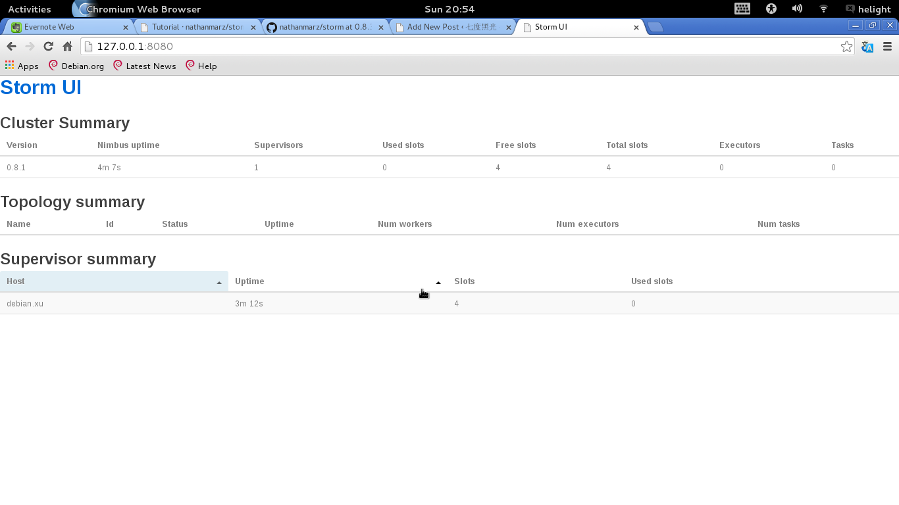

+++
title = "storm安装过程"
date = "2014-03-30T12:57:54+08:00"
tags = ["sqlite"]
categories = ["life"]
banner = "/images/banners/banner-2.jpg"
draft = false
author = "helight"
authorlink = "https://helight.cn"
summary = ""
keywords = ["sqlite"]
+++

storm的官方安装说明：<a href="https://github.com/nathanmarz/storm/wiki/Setting-up-a-Storm-cluster">https://github.com/nathanmarz/storm/wiki/Setting-up-a-Storm-cluster</a>
本文主要介绍storm的单机版的安装测试，也是学习阶段，还没有机会搭建集群。
<!--more-->
### 1.storm安装软件包列表：
python、zookeeper、zeromq、jzmq、storm

```sh
sudo apt-get  install autoconf automake libtool
sudo apt-get  install  build-essential uuid uuid-dev libtool git autoconf openjdk-6-jdk
```
python保证2.7以上版本即可。

```sh
export JAVA_HOME=/usr/lib/jvm/java-6-openjdk-amd64/
```
### 2.Zookeeper下载安装：
我下载的是zookeeper-3.4.6.tar.gz，解压之后直接配置使用

```sh 
vim ~/.bashrc
export ZOOKEEPER_HOME=/data1/tools/zookeeper"                                                       
export PATH=$PATH:$ZOOKEEPER_HOME/bin 
cp $ZOOKEEPER_HOM/conf/zoo_sample.cfg $ZOOKEEPER_HOM/conf/zoo.cfg (用zoo_sample.cfg制作$ZOOKEEPER_HOME/conf/zoo.cfg)
mkdir /tmp/zookeeper
mkdir /var/log/zookeeper
```
zookeepe的单机安装已经完成了。
### 3.storm依赖软件安装：
来安装必要依赖软件。主要是zeromq和jzmp。

先安装zeromq：

一般linux系统只要运行这个install_zmq.sh脚本就可以完成安装，但是在我的debian下这个脚本运行有问题，也没有去细看为什么，所以后面的安装就全是手动安装了

```sh
wget http://download.zeromq.org/zeromq-2.1.7.tar.gz
tar -xzf zeromq-2.1.7.tar.gz
cd zeromq-2.1.7
./configure
make
sudo make install
```
安装jzmq：
```sh
git clone https://github.com/nathanmarz/jzmq.git
cd jzmq
cd src
```
在src目录需要执行下面两行脚本，否则无法编译通过。
```sh
touch classdist_noinst.stamp
CLASSPATH=.:./.:$CLASSPATH javac -d . org/zeromq/ZMQ.java org/zeromq/ZMQException.java org/zeromq/ZMQQueue.java org/zeromq/ZMQForwarder.java org/zeromq/ZMQStreamer.java
```
然后返回上层目录执行编译安装即可。
```sh
cd ..
./autogen.sh
If you get this error "autogen.sh: error: could not find pkg-config.pkg-config is required to run autogen.sh", then install pkg-config. In Ubuntu sudo apt-get install pkg-config and again run the above command.
./configure
make
sudo make install
```
### 4.storm安装与启动
 4.1storm的安装是最为简单的，直接下载解压，配置环境变量即可。

http://storm.incubator.apache.org/downloads.html 可以在这里下载最新的storm，本文使用了0.8.1的版本。

wget http://apache.dataguru.cn/incubator/storm/apache-storm-0.9.1-incubating/apache-storm-0.9.1-incubating.tar.gz
```sh
wget http://cloud.github.com/downloads/nathanmarz/storm/storm-0.8.1.zip
unzip storm-0.8.1.zip
ln -s storm-0.8.1 storm
vim ~/.bashrc
export STORM_HOME=/data1/tools/storm
export PATH=$PATH:$STORM_HOME/bin
```
到此为止单机版的Storm就安装完毕了。
#### 4.1启动zookeeper：
zkServer.sh  单机版直接启动，不用修改什么配置，如集群就需要修改zoo.cfg。

```sh
helight:storm-0.8.1$ zkServer.sh 
JMX enabled by default
Using config: /data1/tools/zookeeper/bin/../conf/zoo.cfg
Usage: /data1/tools/zookeeper/bin/zkServer.sh {start|start-foreground|stop|restart|status|upgrade|print-cmd}
helight:storm-0.8.1$ zkServer.sh start
JMX enabled by default
Using config: /data1/tools/zookeeper/bin/../conf/zoo.cfg
Starting zookeeper ... STARTED
helight:storm-0.8.1$ ps aux|grep zoo
helight  28088  4.7  0.7 1339964 30576 pts/2   Sl   20:12   0:00 /usr/lib/jvm/java-6-openjdk-amd64//bin/java -Dzookeeper.log.dir=. -Dzookeeper.root.logger=INFO,CONSOLE -cp /data1/tools/zookeeper/bin/../build/classes:/data1/tools/zookeeper/bin/../build/lib/*.jar:/data1/tools/zookeeper/bin/../lib/slf4j-log4j12-1.6.1.jar:/data1/tools/zookeeper/bin/../lib/slf4j-api-1.6.1.jar:/data1/tools/zookeeper/bin/../lib/netty-3.7.0.Final.jar:/data1/tools/zookeeper/bin/../lib/log4j-1.2.16.jar:/data1/tools/zookeeper/bin/../lib/jline-0.9.94.jar:/data1/tools/zookeeper/bin/../zookeeper-3.4.6.jar:/data1/tools/zookeeper/bin/../src/java/lib/*.jar:/data1/tools/zookeeper/bin/../conf: -Dcom.sun.management.jmxremote -Dcom.sun.management.jmxremote.local.only=false org.apache.zookeeper.server.quorum.QuorumPeerMain /data1/tools/zookeeper/bin/../conf/zoo.cfg
helight  28114  0.0  0.0   7832   888 pts/2    S+   20:12   0:00 grep --color=auto zoo
```
#### 4.3配置启动storm：
配置文件是storm/conf/storm.yaml

内容：
```sh
storm.zookeeper.servers:
     - 127.0.0.1
storm.zookeeper.port: 2181
nimbus.host: "127.0.0.1"
storm.local.dir: "/tmp/storm"
supervisor.slots.ports:
  - 6700
  - 6701
  - 6702
  - 6703
```
在配置时一定注意在每一项的开始时要加空格，冒号后也必须要加空格，否则storm就不认识这个配置文件了。
说明一下：storm.local.dir表示storm需要用到的本地目录。nimbus.host表示那一台机器是master机器，即nimbus。storm.zookeeper.servers表示哪几台机器是zookeeper服务器。storm.zookeeper.port表示zookeeper的端口号，这里一定要与zookeeper配置的端口号一致，否则会出现通信错误，切记切记。当然你也可以配superevisor.slot.port，supervisor.slots.ports表示supervisor节点的槽数，就是最多能跑几个worker进程（每个sprout或bolt默认只启动一个worker，但是可以通过conf修改成多个）。
执行：

```sh
helight:tools$ storm nimbus &（启动主节点）
helight:tools$ storm supervisor&（启动从节点）
```
启动web监控服务，可以通过浏览器很方便的看运行情况，



<center>
看完本文有收获？请分享给更多人<br>

关注「黑光技术」，关注大数据+微服务<br>


</center>
