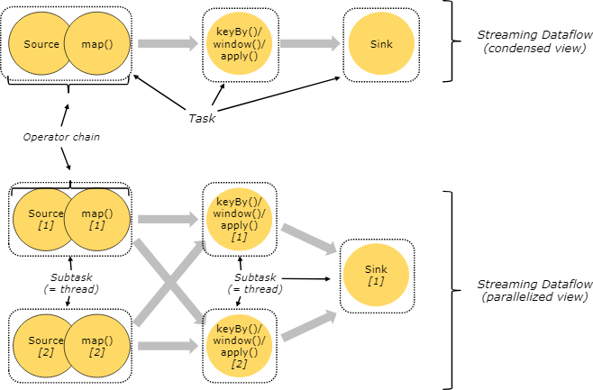
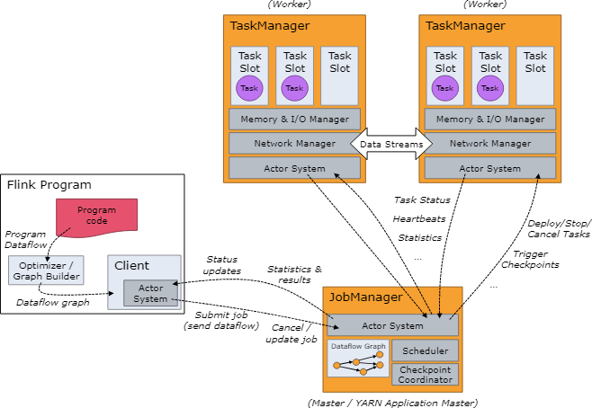
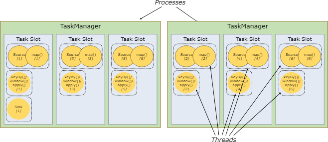
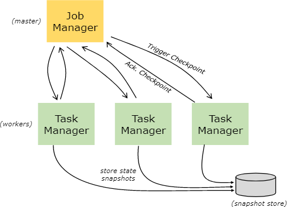

+++
title = "Flink Distributed Runtime Environment"
date = "2018-08-13T12:37:01+08:00"
tags = ["flink"]
categories = ["flink"]
banner = "/images/banners/banner-2.jpg"
draft = false
author = "helight"
authorlink = "https://helight.cn"
summary = ""
keywords = ["flink"]
+++

## Flink分布式运行时环境
1. Tasks and Operator Chains 任务和操作链
1. Job Managers, Task Managers, Clients 作业管理器，任务管理器，客户端
1. Task Slots and Resources 任务执行槽和资源
1. State Backends 转态后端
1. Savepoints 保存点
<!--more-->
## Tasks and Operator Chains 任务和操作链

Flink对分布式任务的执行操作，它是把操作子任务<em>链</em>起来放到<em>任务</em>中。每个任务由一个线程来执行。把操作链起来放入任务中是非常好的一个优化：它可以减少线程间交互和缓存的开销，减少延迟的同时提升整体的吞吐量。链操作的方式是可以配置的，在链操作文档中有详细的介绍<a href="https://ci.apache.org/projects/flink/flink-docs-release-1.7/dev/stream/operators/#task-chaining-and-resource-groups">chaining docs</a> 。

下图中的数据流例子是由5个子任务的一个执行，所以有5个并行的线程。

## Job Managers, Task Managers, Clients 作业管理器，任务管理器和客户端

Flink的运行时环境有两种处理过程：

1. 作业管理（也叫做主节点）协调分布式执行，比如它会调度任务，协调检查点，协调故障恢复。

至少有一个作业管理器，配置了高可用的会有多个作业管理器，但其中一个是主服务，其它都是备用服务。
1. 任务管理器（也叫做工作者）执行数据流程上的任务（或者更具体的说是子任务），任务管理器也缓存和交换数据流。
运行时至少要有一个任务管理器。

启动作业管理器和任务管理器有多种方式：直接在机器上启动独立集群方式<a href="https://ci.apache.org/projects/flink/flink-docs-release-1.7/ops/deployment/cluster_setup.html">standalone cluster</a>, 在容器中启动，或者用<a href="https://ci.apache.org/projects/flink/flink-docs-release-1.7/ops/deployment/yarn_setup.html">YARN</a> 或者 <a href="https://ci.apache.org/projects/flink/flink-docs-release-1.7/ops/deployment/mesos.html">Mesos</a>这类资源管理框架启动。任务执行器连接作业管理器，并告知它可用，再接受任务分派。

## 客户端不是运行环境和程序执行的一部分，但是它要来准备和向作业管理器发送数据流程任务。在这之后，客户端可用断开连接或者继续保持连接并接收处理的反馈信息。客户端可以用java/Scala程序来触发执行，也可以用命令行来执行，例如：./bin/flink run …。

## Task Slots and Resources 任务槽和资源

每个工作节点（任务执行器）是一个JVM的处理器，在单独的线程可以执行一个或者多个子任务。为了控制一个工作节点可以接受的任务数量，工作节点提供了## 任务槽（至少一个任务槽）。

在任务管理器中每个任务槽表示了一组固定的资源。例如：一个任务管理器有3个执行槽，那么就会把它管理内存的1/3分配给每个执行槽。用槽来隔离资源是为了让子任务执行时不用和其它作业的子任务竞争任务管理器管理的内存，而是给每个执行子任务预留了一定数量的内存。提到的一点是这里没有CPU隔离。目前执行槽仅仅只为任务对内存进行隔离。

通过调整执行槽的个数，用户可以规定子任务之间如何隔离。每个作业管理器只有一个执行槽意味着每个任务组都是运行在隔离的JVM中（例如：可以在隔离的容器中启动）。作业管理器有多个执行槽意味着多个子任务共享了同一个JVM。同一个JVM中的任务共享TCP链接（通过多路复用技术）和心跳消息。他们也可以共享数据集和数据结构，以此来减少每个任务的消耗。

默认情况下，Flink允许子任务共享执行槽，甚至不同任务的子任务之间都可以共享，只要他们是属于同一个作业的 。结果是一个执行槽可能有作业的两个全部数据流管道。允许执行槽共享有两个好处。

* 一个Flink集群需要和一个作业中的最高并行数一样多的任务执行槽。不用去计算一个程序总共有多少任务（变化的并行度）。
* 更容易做到资源利用优化。没有执行槽共享，非密集子任务如source/map()会和资源密集型window子任务会阻塞一样多的资源。有了执行槽共享，在我们的例子中把基本并行度从2提升到6，才可以充分利用槽的资源，同时确保重型的子任务会被公平的分布执行。

 
API中也包含了一个资源组<a href="https://ci.apache.org/projects/flink/flink-docs-release-1.7/dev/stream/operators/#task-chaining-and-resource-groups">resource group</a>的机制，可以防止不需要的执行槽共享。
一般来说，比较好的执行槽个数是和cpu核的个数一样的。有超线程的，每个执行槽可以占2个以上硬件线程。

## State Backends 状态后端

存储在kv索引中的准确数据结构是依赖于所选择的状态端的<a href="https://ci.apache.org/projects/flink/flink-docs-release-1.7/ops/state/state_backends.html">state backend</a>。一个状态端在内存中用hashmap来存储数据，另外一个状态端使用<a href="https://ci.apache.org/projects/flink/flink-docs-release-1.7/monitoring/rest_api.html#cancel-job-with-savepoint">RocksDB</a> 作为kv存储。除了定义存储状态的数据接口，状态端也实现了获取kv状态时间点快照的逻辑，并且把这个快照存储作为检查点的一部分。

## Savepoints 保存点

用数据流API写的程序可以从一个## 保存点恢复执行。保存点可以在不丢失状态的情况下更新你的程序和Flink集群。

保存点<a href="https://ci.apache.org/projects/flink/flink-docs-release-1.7/ops/state/savepoints.html">Savepoints</a> 是## 人工触发的检查点，保存点就是把程序的执行做个快照并且写入状态端。用常规检查点机制就可以做到这样的。在执行时，程序会被周期性的在工作节点上做快照，并且产生检查点。对恢复来说，只会用到最近的检查点，并且可以在新检测点做好之后就安全的丢弃早期的检查点。

保存点和周期性的检查点是类似，但是保存点是要## 被用户触发的并且在新检查点完成之后## 不会自动过期。保存点会在下面的情况下被创建：可以通过<a href="https://ci.apache.org/projects/flink/flink-docs-release-1.7/ops/cli.html#savepoints">命令行</a>或者用 <a href="https://ci.apache.org/projects/flink/flink-docs-release-1.7/monitoring/rest_api.html#cancel-job-with-savepoint">REST API</a>撤销一个作业的时候。

 
看完本文有收获？请分享给更多人   关注「黑光技术」，关注大数据+微服务   

 

