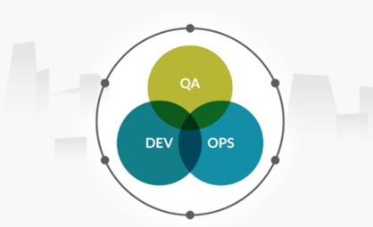
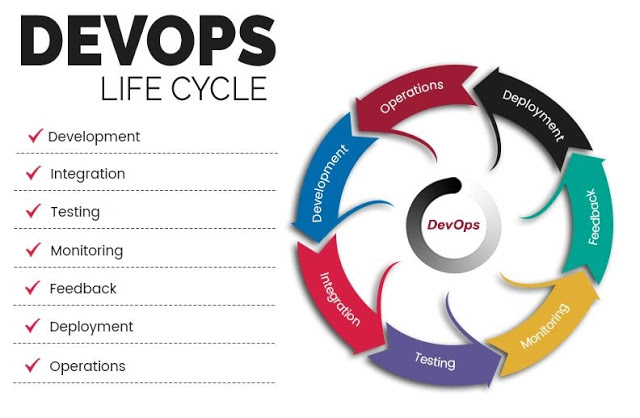

+++
title = "什么是DevOps的生命周期"
date = "2019-05-18T13:47:08+02:00"
tags = ["devops", "开源"]
categories = ["DevOps"]
banner = "/images/banners/DevOPSLifeCycle.jpg"
draft = false
author = "helight"
authorlink = "https://helight.cn"
summary = "DevOps是一个持续的过程，是对开发和运营之间活动关系的一种描述。在DevOps中，所有的参与者，包括工程师，都是为了让组织的流程能够更快，越来越高效和持续进行。这篇文章中会讨论DevOps的生命周期和理解DevOps生命周期中的必要阶段。"
keywords = ["git", "nm", "开源", "linux"]
+++

# 什么是DevOps的生命周期

DevOps是一个持续的过程，是对开发和运营之间活动关系的一种描述。在DevOps中，所有的参与者，包括工程师，都是为了让组织的流程能够更快，越来越高效和持续进行。这篇文章中会讨论DevOps的生命周期和理解DevOps生命周期中的必要阶段。

# 什么是DevOps的生命周期

要想理解DevOps，就必须理解DevOps生命周期的各阶段。一个持续的DevOps生命周期包含了7个阶段，如下：

## 1.持续开发

在这个DevOps阶段，软件开发是一个持续的事情。整个开发过程被分割为几个小的开发周期。通过这样的方式，DevOps团队可以比较容易的加速软件开发和分发过程。

持续开发是DevOps的必要环节，是不可缺少的一部分，面的所有步骤都是以这个环节的产出为基础的。当然后面的环节也不断的反哺或者服务这一环节。

## 2.持续集成

持续集成需要在开发团队和运营团队之间建立工作关系。所以要完成持续集成，集成必须按时完成，并且所有的开发都必须让团队中的所有人都能理解。在这个阶段中，执行流程需要计算自动化，比如代码编译，单元测试和验收测试。这个阶段要提供部署的代码。

自动化必须相互关联，这样如果工程师修改了任意一个执行动作或者调整了代码，编译框架就可以识别。在这个阶段需要完成稳定性测试，并且从源码编译出目标结果。

持续集成是为了加速验证持续开发的结果，是为了加快反馈过程，你开发阶段的内容是不是符合最基本的编译过程，包括一些基本的代码静态检测扫描。帮助开发可以更规范更高效。我们说一个bug的解决越是到后期解决，它的解决成本越高。持续集成就是为了降低这一成本，当然这个过程发现的不一定是bug。持续集成的输入是持续开发的代码，而且持续集成的输出则是后面环节的必需品。

持续集成的关键点必须是自动化的、持续的、高效率的。在实际场景中我们一般以定时集成，或者提交代码就可以触发一个集成任务。这种触发一般都是需要自动化的。另外集成的效率是一个问题，也是一个比较高的技术问题。很多语言和应用的编译方式和编译效率都不一样，所以不同的语言和应用的编译构建都需要不同的技术来支持。比如android和IOS的编译方式，flink程序的编译方式，unity的构建方式，c++，java，golang的编译方式。是不是需要构建缓存，所依赖的第三方库的管理和更新等等都是问题。所以要想有一个比较好用而且高效的持续集成平台，相当有难度。不过开源界也有不少这方面的产品可以简单实用，不过要谈到高效那就有点困难了。

## 3.持续测试

在DevOps中测试过程可以来发现应用的真实功能，Beta分析器产生结果。同时测试过程要保证应用在其实际场景中的结果是符合预期的。测试过程可以收集到应用很多维度的数据，可以直接帮助推动应用程序的开发过程。

这个环节也很重要，但是据我目前了解到的DevOps实现方式，对这块的重视程度并不是很高。大家都重点在讲CICDCO，而对其它方面相对提的较少。大多数时候都是先把CICD建立起来，再围绕CICD建设其它的部分。我认为这种na方式也是可以的，尤其是项目较小的时候，而大家又想采用DevOps的方式。但是DevOps始终是为了解决现代软件开发中中大型项目而发展出的一套方法，所以在要想真正能落地DevOps，这部分还是必不可少。

持续测试的输入是持续集成，有了持续集成的结果才可以进行持续测试，如果集成都失败了，那后面的测试执行起来就很困难了。这部分一般也分为几种方式：
1. 单元测试，
2. 模块功能测试，
3. 模块压力测试，
4. 系统集成测试等。

## 4.持续监控

在这个阶段，负责的团队需要面对应用程序在实际生产环境下出现的麻烦的框架问题或者程序问题。

这个阶段只要是做产品的同学都应该非常重视，让你的产品具有可观测性，你需要知道你的系统何时出现了用户不可用问题，或者用户体验问题或者其它性能等问题。而不是产品交付之后就不管了，对线上出现的问题无感知。这部分就要求你的产品在上线前必须考虑你要对哪些问题进行关注，使用什么方式收集这些信息，并且持续关注这些信息。最后反馈到开发等其它阶段能够去解决。

## 5.持续反馈

反馈对已经发布的产品非常重要，持续的反馈以非常好的方式为整个团队提供了线上实际发生的问题。在DevOps中，反馈是从客户那里收集到信息。基本上来说是客户推动完成计划和开发。收集的信息包含了性能相关的数据和用户体验发生的问题。

## 6.持续部署

完成部署过程后，代码中任何更新点都不能影响线上高流量的站点。

持续部署的重要性就不强调了，CICDCO在很多文章和场景的介绍之下已经深入人心了。这个环节的特点也是几个：自动化，高效率，支持多种策略。

自动化一般体现在代码提交之后打tag或者封版本号等操作时就能自动的触发预先设定好的部署任务，按照设定的部署策略进行自动化的部署工作。高效率是指部署效率，在部署多个副本或者多个地域的时候如何能更快速，稳定的进行部署是个非常高深的技术活。部署策略就不详细说了，常见的灰度策略，蓝绿，金丝雀等等。

## 7.持续运营
所有的DevOps运营都依赖于一致性和自动化的持续交付程序。它可以加速公司的一般的线上运营时间。

任何产品都不能缺失运营，即便是研发出来非常成功的产品，也是不可以缺少运营的。DevOps的各个环节的目的都是为产品服务，为了让产品有更好的品质，产生更高的价值，持续运营亦是如此。

现在你理解了什么是DevOps的生命周期。文中明显可以看出持续性是DevOps消除多余步骤的基本因素。大量多余的步骤阻碍了研发，要花更长的时间来定位问题和开发新版本。

# 总结：
在我来看DevOps是一个组织架构来适应现代软件开发的过程管理。在以前一个人完成一款软件开发是比较容易的，比如张小龙早起的foxmail，他可以一个人就可以完成早期版本的开发。但是随着现在软件需求的发展，这里还是要说是需求驱动了这种软件开发模式，现在的很多软件不再是单机软件，动不动需要分布式，需要跨地域通信，跨地区存储和多数据中心存活，动不动就说需要极高的可靠性，全球管控，全球协作等等等等。这种情况下的软件开发都不再是一个人就可以搞定的了，需要多人，多个团队，甚至是多个公司合作来完成。这样的开发团队和开发模式必然是要新的开发流程来支持。DevOps在一定程度上解决了团队分工合作和效率的问题，其核心思想是加入了自动化和持续性，在自动化和持续性的基础上让各个阶段形成一定程度上的闭环，但是又不割裂各个阶段，让各个阶段即有分工又有合作，而且让各个阶段的参与人员都能有整体的视角去看待整个软件开发过程，从而合理的推动大型项目稳定高效的发展。 

看完本文有收获？请分享给更多人

关注「黑光技术」，关注大数据+微服务

