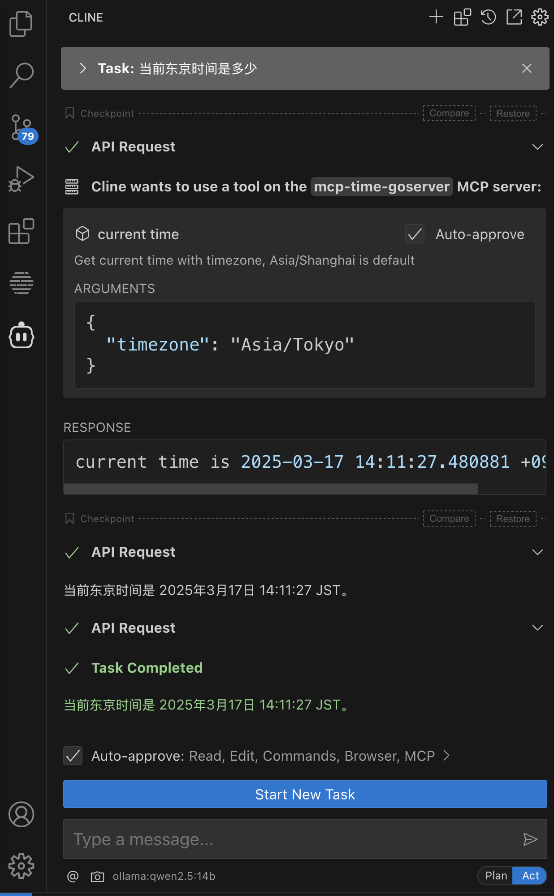

## 一、MCP 介绍
### 1. 基本介绍

MCP（Model Context Protocol，模型上下文协议）是由 Anthropic 公司（Claude 大模型的创造者）于 2024 年 11 月推出的一种开放标准协议，旨在统一大型语言模型（LLM）与外部数据源和工具之间的通信方式。MCP 的核心目标是解决当前 AI 应用开发中的数据孤岛和碎片化集成问题。

### 2. 协议特点
MCP 可以被理解为 AI 大模型的"万能接口"，类似于 USB-C 接口在硬件领域的作用，它提供了一种标准化的方法，使 AI 模型能够与不同的数据源和工具进行无缝交互。通过 MCP，开发者可以更轻松地构建复杂的 AI 应用，而无需为每个工具或数据源编写专门的集成代码。

1. MCP 是一个标准协议，如同电子设备的 Type C 协议(可以充电也可以传输数据)，使 AI 模型能够与不同的 API 和数据源无缝交互。

1. MCP 旨在替换碎片化的 Agent 代码集成，从而使 AI 系统更可靠，更有效。通过建立通用标准，服务商可以基于协议来推出它们自己服务的 AI 能力，从而支持开发者更快的构建更强大的 AI 应用。开发者也不需要重复造轮子，通过开源项目可以建立强大的 AI Agent 生态。

1. MCP 可以在不同的应用/服务之间保持上下文，从而增强整体自主执行任务的能力。

可以理解为 MCP 是将不同任务进行分层处理，每一层都提供特定的能力、描述和限制。而 MCP Client 端根据不同的任务判断，选择是否需要调用某个能力，然后通过每层的输入和输出，构建一个可以处理复杂、多步对话和统一上下文的 Agent。

### 3. AI Agent 和 MCP 间的关系
1. AI Agent 是一个智能系统，它可以自主运行以实现特定目标。传统的 AI 聊天仅提供建议或者需要手动执行任务，AI Agent 则可以分析具体情况，做出决策，并自行采取行动。
2. AI Agent 可以利用 MCP 提供的功能描述来理解更多的上下文，并在各种平台/服务自动执行任务。

### 4. MCP 如何工作

MCP 采用客户端-服务器架构，MCP 架构主要包含以下核心组件：
1. **MCP 客户端**：通常是 AI 大模型，如 Claude、GPT 等，集成在 Host 中的协议客户端，负责将 LLM 请求转换为标准化消息，并与 Server 通信。
2. **MCP 服务器**：提供各种功能的服务，如数据检索、工具调用等，它一般是一个轻量级程序，连接本地或远程数据源（如数据库、API），执行具体操作并返回结果。
3. **MCP 协议**：定义客户端和服务器之间的通信规范
4. **上下文管理器**：负责维护对话上下文和状态


MCP 的基本工作流程如下：
1. 用户向 AI 模型（MCP 客户端）发送请求
2. AI 模型分析请求，确定需要调用的外部工具或数据
3. AI 模型通过 MCP 协议向相应的 MCP 服务器发送请求
4. MCP 服务器处理请求并返回结果
5. AI 模型整合结果，生成最终回复给用户
## 二、cline 配置本地模型
我做测试使用的客户端是 vscode+cline，cline 在 vscode 的插件市场中直接安装即可。cline 对 MCP 的支持也是非常好的。因为要使用到大模型，所以这里还要给 cline 配置一个大模型。
外网开放的免费模型一般都不太好用，所以我一般都是配置本地模型来测试，这里也介绍一下 cline 如何配置本地模型。我这里配置了 ollama 启动的 qwen2.5:14b 模型。如下图配置即可，这个配置过程比较简单。


## 三、MCP 服务开发
### 1. 典型应用场景
1. ​实时数据分析：LLM 通过 MCP 直接查询数据库生成动态报告（如销售数据可视化）。
2. ​跨平台自动化：结合本地文件读写和 API 调用，实现“读取文档 → 生成会议摘要 → 发送邮件”全流程自动化。
3. ​隐私敏感任务：医疗数据存储在本地 Server，模型处理时不外传，符合 GDPR 合规要求。
4. ​工具增强生成：例如代码编辑器中集成 MCP Server，根据用户需求调用图像生成工具自动插入图片。

### 2. 案例开发
这部分代码参考了这篇文章：https://mp.weixin.qq.com/s/JmPxMBRZa8UhsIOQVgupLw
，这篇文章主要是一个按照时区获取时间的工具，我在测试 ok 之后扩展了一个天气获取的工具。

天气接口使用的是腾讯云的接口，大家可以直接使用免费额度，代码也是直接从腾讯云 api 的介绍中拷贝过来的，这里做了简单的封装调用。

下面的代码直接拷贝过去就可以使用，不过天气 api 的 key要替换成你自己的。

``` golang
package main

import (
	"context"
	"crypto/hmac"
	"crypto/sha1"
	"encoding/base64"
	"fmt"
	"io"
	"io/ioutil"
	"net/http"
	gourl "net/url"
	"strings"
	"time"

	"github.com/mark3labs/mcp-go/mcp"
	"github.com/mark3labs/mcp-go/server"
)

func main() {
	// GetWeaher("北京")
	// Create MCP server
	s := server.NewMCPServer("MCPDemo", "1.0.0")
	// Add Get time tool
	timetool := mcp.NewTool("current_time",
		mcp.WithDescription("Get current time with timezone, Asia/Shanghai is default"),
		mcp.WithString("timezone", mcp.Required(), mcp.Description("current time timezone")))
	// Add tool handler
	s.AddTool(timetool, currentTimeHandler)

	// add weather tool
	weathertool := mcp.NewTool("current_weather",
		mcp.WithDescription("Get current weather with city name, 北京 is default, 需要输入中文"),
		mcp.WithString("city", mcp.Required(), mcp.Description("city name")))
	// Add tool handler
	s.AddTool(weathertool, weatherHandler)
	// Start the stdio server
	if err := server.ServeStdio(s); err != nil {
		fmt.Printf("Server error: %v\n", err)
	}
}

func currentTimeHandler(ctx context.Context, request mcp.CallToolRequest) (*mcp.CallToolResult, error) {
	timezone, ok := request.Params.Arguments["timezone"].(string)
	if !ok {
		return mcp.NewToolResultError("timezone must be a string"), nil
	}
	loc, err := time.LoadLocation(timezone)
	if err != nil {
		return mcp.NewToolResultError(fmt.Sprintf("parse timezone with error: %v", err)), nil
	}
	return mcp.NewToolResultText(fmt.Sprintf(`current time is %s`, time.Now().In(loc))), nil
}

func weatherHandler(ctx context.Context, request mcp.CallToolRequest) (*mcp.CallToolResult, error) {
	city, ok := request.Params.Arguments["city"].(string)
	if !ok {
		return mcp.NewToolResultError("city must be a string"), nil
	} 
	body, err := GetWeaher(city)
	if err != nil {
		return mcp.NewToolResultError(fmt.Sprintf("read response body with error: %v", err)), nil
	}
	return mcp.NewToolResultText(string(body)), nil
}

func calcAuthorization(source string, secretId string, secretKey string) (auth string, datetime string, err error) {
	timeLocation, _ := time.LoadLocation("Etc/GMT")
	datetime = time.Now().In(timeLocation).Format("Mon, 02 Jan 2006 15:04:05 GMT")
	signStr := fmt.Sprintf("x-date: %s\nx-source: %s", datetime, source)

	// hmac-sha1
	mac := hmac.New(sha1.New, []byte(secretKey))
	mac.Write([]byte(signStr))
	sign := base64.StdEncoding.EncodeToString(mac.Sum(nil))

	auth = fmt.Sprintf("hmac id=\"%s\", algorithm=\"hmac-sha1\", headers=\"x-date x-source\", signature=\"%s\"",
		secretId, sign)

	return auth, datetime, nil
}

func urlencode(params map[string]string) string {
	var p = gourl.Values{}
	for k, v := range params {
		p.Add(k, v)
	}
	return p.Encode()
}

func GetWeaher(city string) (ret string, err error) {
	// 云市场分配的密钥Id
	secretId := "xxx"
	// 云市场分配的密钥Key
	secretKey := "xxx"
	source := "usagePlan-xxx"

	// 签名
	auth, datetime, _ := calcAuthorization(source, secretId, secretKey)

	// 请求方法
	method := "GET"
	// 请求头
	headers := map[string]string{"X-Source": source, "X-Date": datetime, "Authorization": auth}

	// 查询参数
	queryParams := make(map[string]string)
	queryParams["areaCn"] = city
	queryParams["areaCode"] = ""
	queryParams["ip"] = ""
	queryParams["lat"] = ""
	queryParams["lng"] = ""
	queryParams["need1hour"] = ""
	queryParams["need3hour"] = ""
	queryParams["needIndex"] = ""
	queryParams["needObserve"] = ""
	queryParams["needalarm"] = ""
	// body参数
	bodyParams := make(map[string]string)

	// url参数拼接
	url := "https://service-6drgk6su-1258850945.gz.apigw.tencentcs.com/release/lundear/weather1d"
	if len(queryParams) > 0 {
		url = fmt.Sprintf("%s?%s", url, urlencode(queryParams))
	}

	bodyMethods := map[string]bool{"POST": true, "PUT": true, "PATCH": true}
	var body io.Reader = nil
	if bodyMethods[method] {
		body = strings.NewReader(urlencode(bodyParams))
		headers["Content-Type"] = "application/x-www-form-urlencoded"
	}

	client := &http.Client{
		Timeout: 5 * time.Second,
	}
	request, err := http.NewRequest(method, url, body)
	if err != nil {
		panic(err)
	}
	for k, v := range headers {
		request.Header.Set(k, v)
	}
	response, err := client.Do(request)
	if err != nil {
		panic(err)
	}
	defer response.Body.Close()

	bodyBytes, err := ioutil.ReadAll(response.Body)
	if err != nil {
		panic(err)
	}
	fmt.Println(string(bodyBytes))
	return string(bodyBytes), nil
}

```
## 四、Cline 上配置自己开发的 MCP 服务

在 Cline 上添加 MCP 服务点击右上角“+”号旁边的 4 个小方块按钮即可进入。里面有默认的服务市场和已经安装，我们在已经安装这个 tab 中选择 “Configure MCP Servers”，打开配置文件编辑，填写以下内容：

``` json
{
  "mcpServers": {
    "helight-mcpServers": {
      "command": "/Users/helightxu/aillm/mcpgolangtest/mcp-server",
      "args": [],
      "env": {},
      "disabled": false,
      "autoApprove": [
        "current_weather",
        "current_time"
      ]
    }
  }
}
```
主要就是MCP 服务的名称，里面服务二进制地址等配置。这里还有一个“autoApprove”配置项，这个就是在执行命令的时候是否需要人工二次确认还是自动确认。配置之后就可以看到下图的内容了。


这里还可以点击下面的“Restart Server”，对服务进行重启，重启之后也会获取最新的服务工具信息。在你重新编译 MCP 服务之后，这里一般需要点击重启一下。

## 五、案例测试

### 1. 时间获取案例
这里输入“当前东京的时间是多少”，执行过程如下，就会在大模型解析之后去调用我们的工具进行执行获取结果，并且会对工具返回的结果使用大模型进行再次组织。


### 2. 天气获取案例
天气这里也是，提问：“深圳的天气怎么样”，在大模型分析之后就会调用我们的天气获取工具进行天气信息获取，获取之后再使用大模型进行信息组织和展示。


这里是对信息的再次组织


## 五、MCP 的优势和典型应用场景
### 1. 核心优势
从系统集成和开放集成的角度来看，我认为 MCP会带来以下的突破。

1. ​打破数据孤岛：通过统一协议连接异构系统（如本地文档、云服务），减少大量的适配代码开发量。
2. ​双向动态交互：支持实时请求-响应和主动通知（如 WebSocket），相比传统 API 的静态交互更灵活。

3. 隐私与安全: 
    1. 数据隔离：敏感操作（如医疗数据处理）在本地 Server 完成，无需向 LLM 提供商暴露密钥。
    2. 权限控制：Server 可自主定义访问范围，防止越权操作。

4. ​开发效率提升: 开发者只需关注业务逻辑，无需重复实现通信层，例如通过 Python SDK 快速构建天气查询服务。

## 2. MCP 目前比较典型的应用场景

我认为目前 MCP 的一些典型应用场景会在以下几个方面，不过这个应该发展会很快，未来也许会有更为复杂的应用场景出现。

1. 智能助手增强

MCP 可以显著增强智能助手的能力，使其能够：
- 访问实时信息（如天气、新闻、股票价格等）
- 执行复杂计算
- 查询和操作数据库
- 控制外部设备和系统

2. 企业知识管理

在企业环境中，MCP 可以帮助：
- 构建智能知识库
- 实现跨部门数据共享
- 自动化文档处理和分析
- 提供个性化的员工支持

3. 垂直领域应用

MCP 在各个垂直领域都有广泛应用：
- **医疗**：连接医疗记录系统、诊断工具和医学知识库
- **金融**：整合市场数据、风险评估工具和交易系统
- **教育**：连接学习资源、评估工具和个性化学习系统
- **制造**：连接生产系统、质量控制工具和供应链管理系统

## 六、总结
我认为这种模式应该是 AI 应用的趋势，不做大模型，而是做大模型、内容信息和工具之间的一种胶水层，是一种思考模式的实现。感觉未来大厂的这些工具都会向这个方向发展。在特定的领域之内，结合大模型、具体场景信息和相关工具，思考组织执行方式和流程，最终完成一个自动化大规模计算的复杂任务。比如复杂的 k8s 集群运维，复杂大规模的数据分析。

多智能体协作系统应该是未来的大趋势。而 MCP 在多智能体系统中的应用是其最强大的特性之一。通过 MCP，多个 AI 智能体可以协同工作，各自负责不同的任务，并通过标准化的接口进行通信。

多智能体可能的一个架构：
```
多智能体系统
├── 协调者智能体（Coordinator Agent）
├── 专家智能体 1（Expert Agent 1）
├── 专家智能体 2（Expert Agent 2）
├── ...
└── 专家智能体 N（Expert Agent N）
```

## 六、参考
1. https://mp.weixin.qq.com/s/JmPxMBRZa8UhsIOQVgupLw
2. https://guangzhengli.com/blog/zh/model-context-protocol/