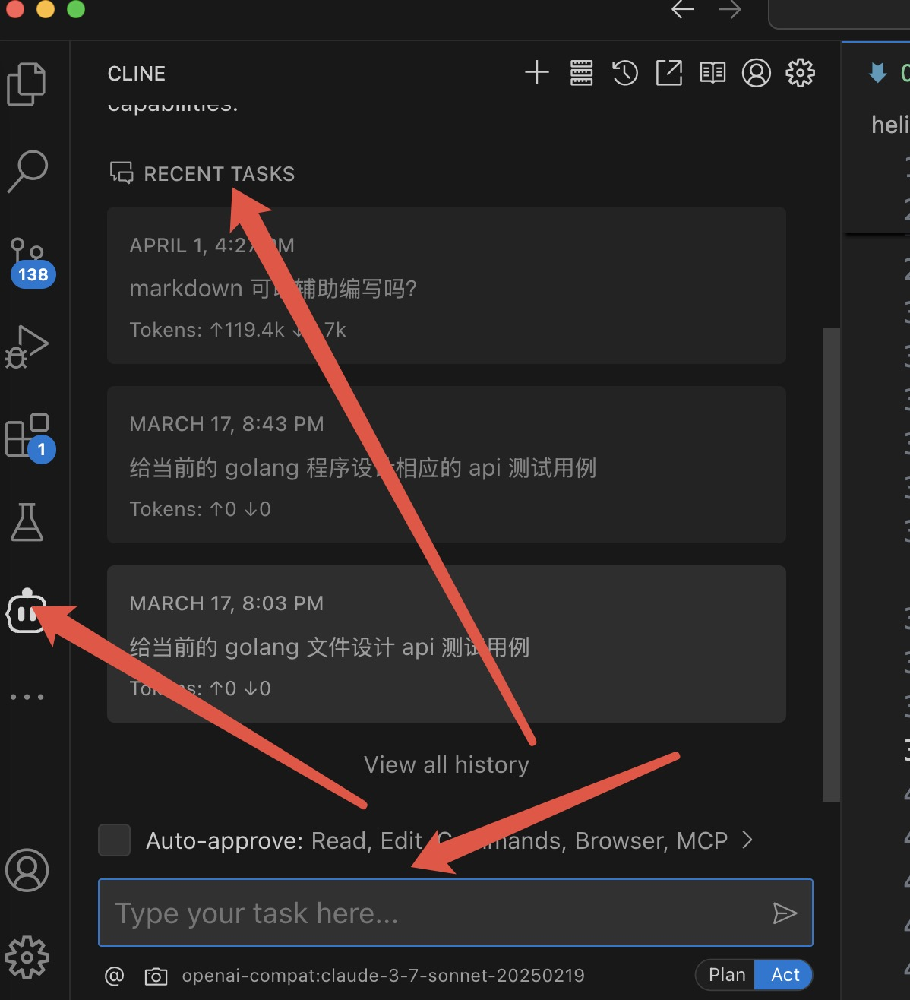

本文介绍如何在 Visual Studio Code (VSCode) 中安装和自定义配置 CLine 插件，并使用 Claude 3.7 模型进行 AI 开发。
<!--more-->

## CLine 插件介绍

CLine 是一款强大的 Visual Studio Code 插件，它将 Anthropic 的 Claude AI 模型集成到您的编码环境中。这款插件允许开发者直接在 VSCode 中与 Claude 模型进行交互，从而提高编码效率和解决问题的能力。

### CLine 的主要特点

- **代码辅助**：帮助编写、解释、调试和优化代码
- **自然语言交互**：使用自然语言提问和获取回答
- **上下文感知**：能够理解您的代码库和当前工作环境
- **多模型支持**：支持 Claude 3 系列模型（包括 Claude 3.7）以及兼容 OpenAI API 的其他模型
- **自定义配置**：可根据个人需求和工作流程进行定制

### 为什么选择 CLine

与其他 AI 编码助手相比，CLine 结合了 Claude 模型的强大能力和 VSCode 的灵活性，提供了更加智能和个性化的编码体验。它不仅能够理解复杂的编程概念，还能根据上下文提供相关的建议和解决方案。

## 安装与配置

### 安装 CLine 插件

1. 打开 Visual Studio Code
2. 点击左侧的扩展图标或按下 `Ctrl+Shift+X`（Windows/Linux）或 `Cmd+Shift+X`（macOS）
3. 在搜索框中输入 "CLine"
4. 找到 CLine 插件并点击 "安装"

### 配置 Claude API

要使用 Claude 3.7 模型，您需要：

1. 需要注册响应的 API，获取 API 密钥和 模型 ID。
2. 在 VSCode 中配置 CLine 插件：
   - 打开 VSCode 设置（`Ctrl+,` 或 `Cmd+,`）
   - 搜索 "CLine"
   - 在相应字段中输入您的 API 密钥
   - 选择 "Openai Compatible" 模式
   - 设置模型为 "claude-3-7-sonnet-20250219"

> [!NOTE]
> 重点：无论是用 Openai GPT系列模型还是 Claude系列模型，都是选择 Openai 兼容 Openai Compatible 模式 ！！！

## 模型配置
这里是我们内部代理过去的一个claude-3-7-sonnet-20250219，所以先要是用Openai Compatible 模式，然后配置我们自己的 url 和 key。

## 基本使用

### 与 CLine 交互的方式

1. **侧边栏聊天界面**
   - 点击 VSCode 左侧活动栏中的 CLine 图标打开聊天界面
   - 在聊天输入框中输入问题或请求，按 Enter 发送
   - 可以进行连续对话，保持上下文

2. **命令面板操作**
   - 按下 `Ctrl+Shift+P`（Windows/Linux）或 `Cmd+Shift+P`（macOS）打开命令面板
   - 输入 "CLine" 查看所有可用命令
   - 选择需要的命令，如 "CLine: Ask a Question" 或 "CLine: Explain Code"

3. **右键菜单操作**
   - 在代码编辑器中选择代码片段
   - 右键点击，从上下文菜单中选择 CLine 相关选项
   - 如 "CLine: Generate Suggestions" 或 "CLine: Explain Selected Code"

4. **快捷键操作**
   - 使用预设快捷键直接触发 CLine 功能
   - 可在 VSCode 键盘快捷键设置中自定义 CLine 操作的快捷键

### CLine 主要使用场景

1. **代码编写与生成**
   - 根据自然语言描述生成代码片段或完整函数
   - 补全部分编写的代码
   - 生成样板代码（如类定义、接口实现等）
   - 示例：输入"创建一个处理用户登录的 React 组件"，CLine 会生成相应代码

2. **代码解释与理解**
   - 解释选中的复杂代码片段功能
   - 分析代码的工作原理
   - 解释特定语言的语法或特性
   - 示例：选中一段使用高级特性的代码，右键选择"CLine: Explain Selected Code"

3. **代码调试与错误修复**
   - 分析代码中的错误并提供修复建议
   - 解释编译器或运行时错误信息
   - 提供针对特定问题的调试策略
   - 示例：复制错误信息并询问"这个错误是什么意思？如何修复？"

4. **代码优化与重构**
   - 提供性能优化建议
   - 重构代码以提高可读性和可维护性
   - 识别代码中的反模式并提供改进方案
   - 示例：选中代码后右键选择"CLine: Generate Suggestions"获取优化建议

5. **文档生成**
   - 为函数、类或模块生成文档注释
   - 创建 README 文件或项目文档
   - 生成 API 文档
   - 示例：选择一个函数，请求"为这个函数生成 JSDoc 注释"

6. **学习与教育**
   - 解释编程概念和原理
   - 提供学习资源和教程建议
   - 回答编程相关问题
   - 示例：询问"解释一下 JavaScript 中的闭包概念并给出示例"

7. **项目规划与设计**
   - 帮助设计软件架构
   - 提供设计模式建议
   - 协助进行技术选型
   - 示例：询问"我需要开发一个电子商务网站，应该使用什么技术栈？"

8. **技术问题咨询**
   - 解答特定技术或库的使用问题
   - 提供故障排除建议
   - 比较不同技术方案的优缺点
   - 示例：询问"React 中 useEffect 和 useLayoutEffect 有什么区别？"

### 常用命令与功能

1. **代码生成与补全**
   - `CLine: Generate Code`：根据描述生成代码
   - `CLine: Complete Code`：补全当前正在编写的代码
   - `CLine: Generate Function`：生成完整函数实现

2. **代码解释**
   - `CLine: Explain Selected Code`：解释选中的代码片段
   - `CLine: Explain File`：解释当前文件的功能和结构
   - `CLine: Explain Error`：解释错误信息并提供解决方案

3. **单元测试生成**
   - `CLine: Generate Tests`：为选中的代码生成单元测试
   - `CLine: Test Coverage Analysis`：分析测试覆盖情况并提供建议

4. **文档注释生成**
   - `CLine: Generate Documentation`：为代码生成文档注释
   - `CLine: Generate README`：为项目生成 README 文件

5. **代码转换**
   - `CLine: Convert Code`：将代码从一种语言转换为另一种语言
   - `CLine: Refactor Code`：重构选中的代码

6. **代码审查与建议**
   - `CLine: Review Code`：审查代码并提供改进建议
   - `CLine: Generate Suggestions`：为选中代码生成优化建议

### 使用技巧与最佳实践

1. **提问技巧**
   - 提供清晰、具体的问题描述
   - 包含必要的上下文信息
   - 对复杂问题，将其分解为更小的部分
   - 示例：不要只问"这段代码有什么问题？"，而是"这段代码在处理大数据集时性能较差，如何优化？"

2. **上下文管理**
   - 在相关文件打开的情况下提问，以便 CLine 获取更多上下文
   - 在对话中引用之前的问题和回答
   - 适当时使用 `CLine: Clear Conversation` 开始新的对话

3. **模型参数调整**
   - 根据需要调整模型参数（如温度、最大令牌数等）
   - 对于创意任务使用较高的温度值
   - 对于精确的代码生成使用较低的温度值

4. **与其他工具结合使用**
   - 将 CLine 与版本控制工具结合使用，如请求解释 git 差异
   - 与调试工具结合，分析调试输出
   - 与项目管理工具结合，如生成任务描述或技术文档

## 总结

CLine 插件为 VSCode 用户提供了强大的 AI 辅助开发能力，通过集成 Claude 3.7 等先进模型，显著提升了编码效率和问题解决能力。本文介绍了 CLine 的安装配置过程、主要功能特点以及实际应用场景。

CLine 的上下文感知能力和多模型支持使其成为目前开发中不可或缺的工具，特别适合需要快速学习新技术、解决复杂问题或提高代码质量的开发者。我感觉我在开发中它已经是不可缺少了。
