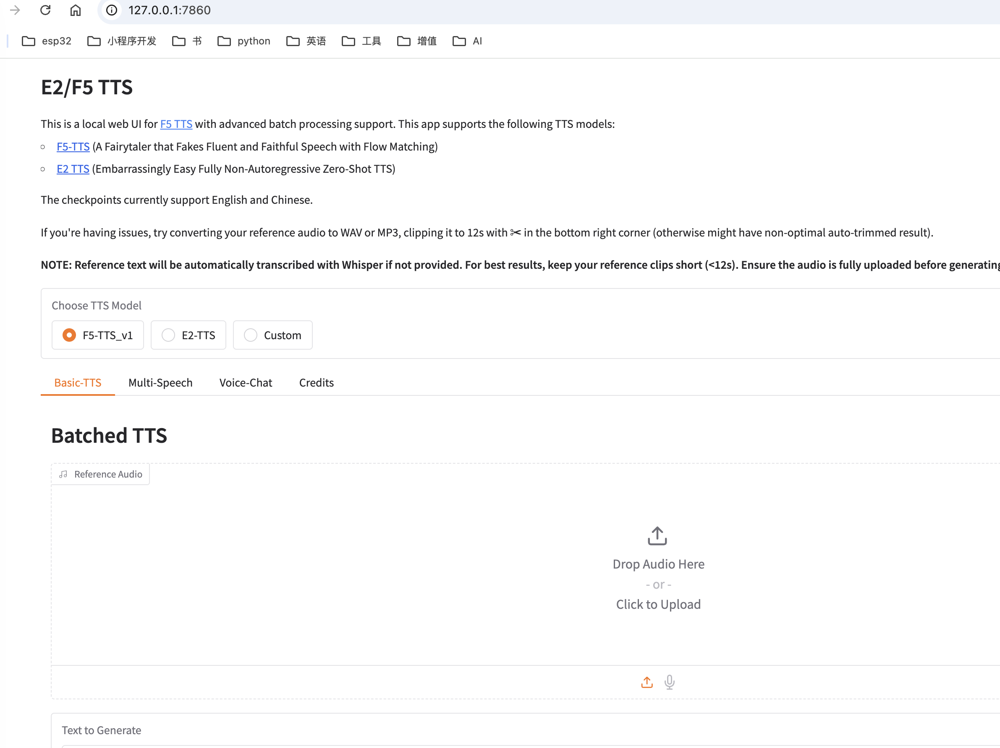

## 一、F5-TTS介绍
1. ​特点：基于E2-TTS改进，2秒音频即可复刻音色，推理速度优于阿里 CosyVoice，支持多音色克隆和情绪风格调整（如Shouting）。
2. ​部署体验：通过ModelScope可在线测试，本地部署需Hugging Face模型下载，显存占用较低，适合生产环境。
3。 ​适用场景：有声读物、多角色播客。
项目地址：[GitHub](https://github.com/SWivid/F5-TTS)

<!--more-->

## 二、mac 上安装部署
### 下载代码
``` sh
git clone https://github.com/SWivid/F5-TTS.git
cd F5-TTS
# git submodule update --init --recursive  # (optional, if need > bigvgan)
pip install -e .
```
### 启动
``` sh
# Launch a Gradio app (web interface)
f5-tts_infer-gradio

# Specify the port/host
f5-tts_infer-gradio --port 7860 --host 0.0.0.0

# Launch a share link
f5-tts_infer-gradio --share
```

我们使用 webui 来启动使用f5-tts，使用"f5-tts_infer-gradio"启动后如下：
``` sh
(base) helightxu•~/F5-TTS(main)» f5-tts_infer-gradio 
The cache for model files in Transformers v4.22.0 has been updated. Migrating your old cache. This is a one-time only operation. You can interrupt this and resume the migration later on by calling `transformers.utils.move_cache()`.
0it [00:00, ?it/s]
Download Vocos from huggingface charactr/vocos-mel-24khz

vocab :  /Users/helightxu/F5-TTS/src/f5_tts/infer/examples/vocab.txt
token :  custom
model :  /Users/helightxu/.cache/huggingface/hub/models--SWivid--F5-TTS/snapshots/84e5a410d9cead4de2f847e7c9369a6440bdfaca/F5TTS_v1_Base/model_1250000.safetensors

/opt/anaconda3/lib/python3.12/site-packages/gradio/components/chatbot.py:282: UserWarning: You have not specified a value for the `type` parameter. Defaulting to the 'tuples' format for chatbot messages, but this is deprecated and will be removed in a future version of Gradio. Please set type='messages' instead, which uses openai-style dictionaries with 'role' and 'content' keys.
  warnings.warn(
Starting app...
* Running on local URL:  http://127.0.0.1:7860

To create a public link, set `share=True` in `launch()`.
```

启动后界面如下：


## 三、基本使用

F5-TTS的基本使用非常简单，通过WebUI界面可以轻松实现语音合成。以下是基本使用步骤：

### 1. 文本输入
在WebUI界面的"Text"文本框中输入您想要转换为语音的文本内容。F5-TTS支持中英文混合输入，可以处理较长的文本段落。

### 2. 参考音频上传
- 点击"Reference Audio"下的"Upload Audio"按钮上传参考音频
- 参考音频应为清晰的人声，长度建议在2-10秒之间
- 支持常见的音频格式如WAV、MP3等
- 音频质量越高，克隆效果越好

### 3. 参数调整
F5-TTS提供了多种参数可以调整以获得最佳效果：

- **Speed**：调整语音速度，默认为1.0，值越大语速越快
- **Pitch**：调整音高，默认为0，可以提高或降低音调
- **Energy**：调整语音能量/音量，默认为1.0
- **Emotion**：选择情感风格，如Normal（正常）、Happy（开心）、Sad（悲伤）、Angry（愤怒）等
- **Emotion Strength**：调整情感强度，值越大情感表现越明显

### 4. 生成语音
调整好参数后，点击"Generate"按钮开始生成语音。生成过程会显示进度条，完成后会自动播放生成的语音。

### 5. 批量处理
如果需要处理大量文本，可以使用批处理功能：
- 在"Batch Processing"选项卡中上传包含多行文本的TXT文件
- 设置输出目录
- 点击"Process Batch"开始批量生成

### 6. 保存和导出
- 生成的语音可以通过界面上的下载按钮保存为WAV格式
- 也可以直接复制生成的音频链接分享给他人

### 高级技巧

1. **混合音色**：上传多个参考音频可以混合不同的音色特征
2. **长文本处理**：对于较长的文本，建议按自然段落分割处理，效果更佳
3. **音频后处理**：生成的音频可以通过其他工具进行降噪、均衡等后期处理
4. **提示词优化**：在文本中添加适当的标点和语气词可以使生成的语音更自然

## 四、总结
F5-TTS的优势在于仅需极短的参考音频即可实现高质量的语音克隆，非常适合个性化语音内容的创作。

F5-TTS作为一款强大的语音合成工具，具有以下突出优势：

1. **低门槛高效能**：仅需2秒参考音频即可精准复刻音色，技术门槛低但效果出众
2. **资源占用小**：显存占用较低，适合在普通消费级硬件上运行
3. **多样化调整**：支持速度、音高、情感等多维度参数调整，满足不同场景需求
4. **中英双语支持**：对中英文混合文本有良好支持，发音自然流畅
5. **批量处理能力**：提供批处理功能，适合大规模内容生产

无论是个人创作者还是专业内容团队，F5-TTS都能以简单直观的操作流程，快速实现高质量的语音合成，为有声内容创作提供强有力的工具支持。相比商业TTS服务，F5-TTS在保持高质量输出的同时，提供了更灵活的本地部署选项和更丰富的个性化调整能力。
