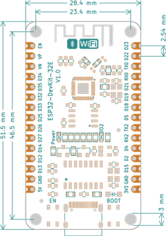
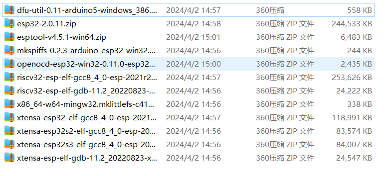

ESP32 DevKit 32E 使用说明。

<!--more-->

## 一、板子实图

## 功能介绍
ESP32 DevKit 32E是基于乐鑫科技的 ESP32-WROOM-32基础上开发的一款适用于创客教育的标志性产品，Flash大小4MB，集成 2.4 GHz、Wi-Fi 和蓝牙双模的单芯片方案。

| 产品尺寸   | 电源输入     | ROM   | 串口芯片   |
| --------  | -------- | ------ | ------ |
|51.5*28.4mm|Type-C|4M|GH340G|

### 2.1 ESP32 DevKit 32E 芯片参数
1. 448 KB ROM,520 KB SRAM,16 KB RTC SRAM
2. QSPI 支持多个 flash/SRAM
3. 内置 8 MHz 振荡器
4. 支持自校准
5. 内置 RC 振荡器，支持自校准
6. 支持外置 2 MHz 至 60 MHz 的主晶振（如果使用 Wi-Fi/蓝牙功能，则目前仅支持 40 MHz 晶振）
7. 支持外置 32 kHz 晶振，用于 RTC，支持自校准
8. 2 个定时器群组，每组包括 2 个 64-bit 通用定时器和 1 个主系统看门狗
9. 1 个 RTC 定时器
10. RTC 看门狗
11. 带有专用 DMA 的以太网 MAC 接口，支持 IEEE 1588
12. 双线汽车接口（TWAI®，兼容 ISO11898-1） x IR (TX/RX)

### 2.2 产品参数
1. 采用乐鑫原装V3版本芯片ESP32-WROOM-32E
2. 烧录端口使用Type-C接口
3. 输入电压： 6-12V
4. M3定位孔直径：3mm
5. 软件支持Mixly、Arduino IDE、MicroPython等

### 2.3 引脚说明	

1. GH340G模块，用于USB转串口与ESP32对接
2. Type-C接口，用于程序下载、固件升级和电源输入
3. ESP32-WROOM-32E芯片
4. 复位按键
5. BOOT按键
6. ESP32模组引出GPIO


  **提示框** 下表显示了哪些管脚最适合用作输入和输出，哪些管脚需要谨慎使用。


|端口	|输入	|输出	|备注信息|
| --------  | -------- | ------ | ------ |
|3.3V|||			3.3V电源输出|
|5V	|||		5V电源输出|
|GND|||			接地|
|0	|pulled up|	是	||
|1	|TX Pin	|是	||
|2	|是	|是	||
|3	|是	|RX Pin	||
|4-5	|是|	是||	
|6-11	|否	|否	|模组集成SPI flash|
|12-33	|是	|是	||
|34-35	|是	|否	|输入引脚|
|36（VP）|是 |否	|输入引脚|
|39（VN）|是 |否	|输入引脚|


  **提示框** :
  1. 不建议将6、7、8、9、10、11管脚用作输入或输出，因为被模组中 SPI-FLASH 占用。
  2. 使用 Wi-Fi 时不能使用 ADC2 管脚。因此，如果您使用 Wi-Fi，并且无 法从 ADC2 GPIO 获取值，则可以考虑改用 ADC1 GPIO。
  3. 启用（EN）是 3.3V 调节器的启用引脚。它被拉起来了，所以接地使 3.3V 调节器失效。这意味着您可以使用连接到按钮的该管脚来重新启动 ESP32。


### 2.4 原理图

## 三、ESP32 DevKit 32E 驱动安装
[参考CH340驱动说明文档进行安装](https://docs.emakefun.com/CH340/CH340/)。

## 四、ESP32 DevKit 32E下载程序
该主板支持使用Arduino IDE、MicroPython等代码编程，也支持Mixly、Mind+等图形化编程。

### 4.1 通过Arduino IDE下载程序
请前往 [Arduino官网](https://www.arduino.cc/en/Main/Software) 下载最新IDE

1. 打开Ardunio IDE;
2. 安装ESP32库；

1) 点击Arduino IDE菜单栏：【文件】-->【首选项】

将 https://dl.espressif.com/dl/package_esp32_index.json 这个网址复制到附加管理器地址

2) 菜单栏点击 【工具】->【开发板】->【开发板管理器】搜索esp32，然后安装，如下图：

注：

下载第一个工具的时候可能会出现错误的情况，这种情况直接重新点击下载就可以了，下载的比较慢，不要着急。

下载第二个工具的时候可能会出现下载错误，不要慌，再试几次如果不行的话，使用手机（不使用流量也可以）开个热点，电脑连手机的热点就可以下载了。虽然下载的较慢，但是步骤极为简单。

如果实在下载不下来，可以下载ESP32离线包 提取码yr72，将下载的所有离线包复制到

C:\Users\这里是用户名\AppData\Local\Arduino15\staging\packages 文件夹里，然后重新启动IDE，搜索ESP，这次就可以快速安装了

安装完成后，打开IDE，先选择主板，如下图

将写好程序点击上传按钮，等待程序上传成功，如下图。

点击串口工具就可以看到串口的打印。如下图

### 4.2 MicroPython
ESP32需要连接到计算机时，是在线运行的。用户可以使用Thonny编写和调试程序。

（1）打开Tonny并单击image62 ，然后单击“此电脑”。

（2）在弹出的页面选择路径“基础输入模块\01 HelloWorld\MicroPython”下的“lesson_01_HelloWorld.py“Python 文件，然后单击”打开“。

（3）单击image65或按下“F5”键，Shell窗口将打印出”Hello World“。

