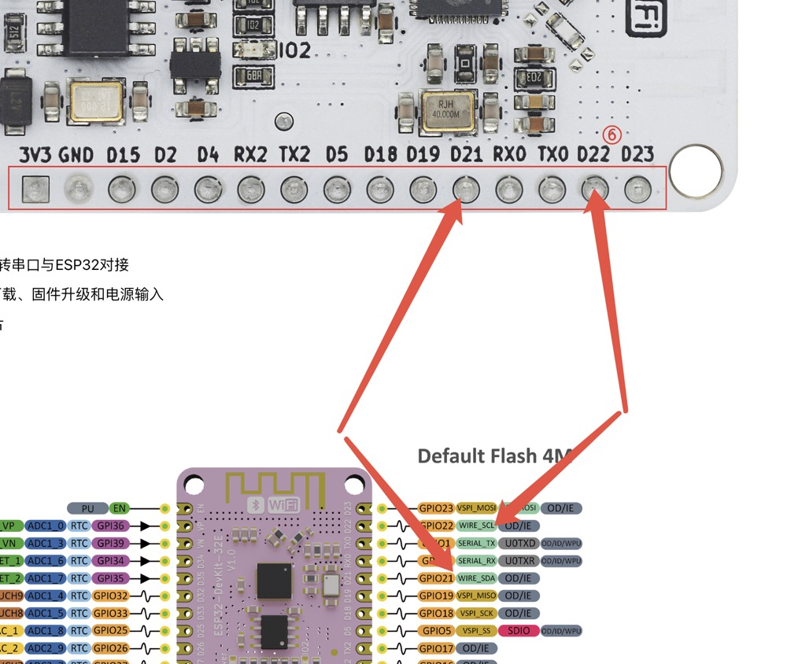
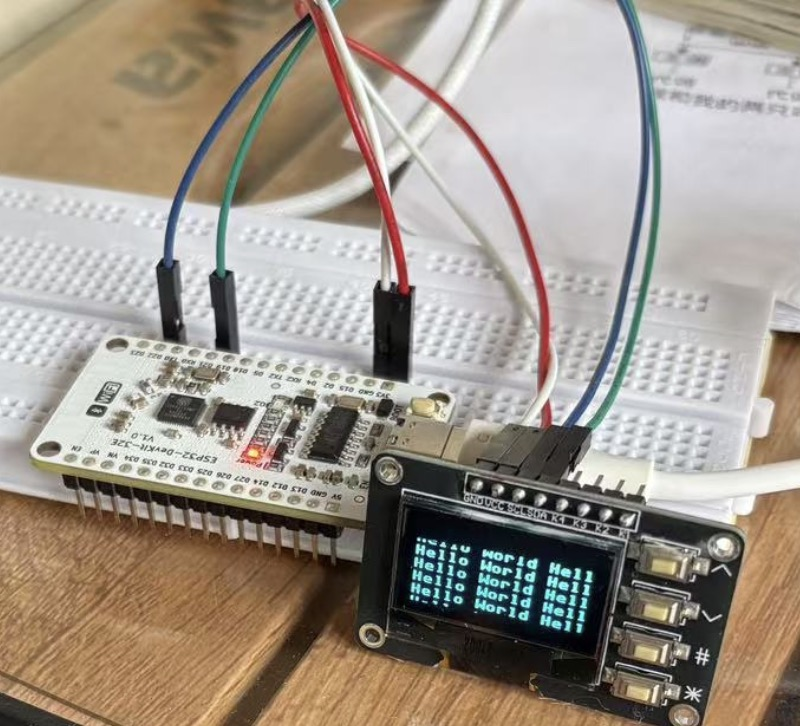
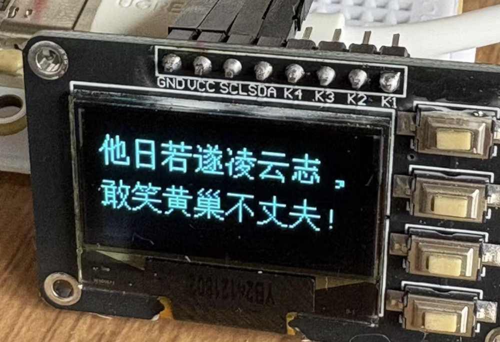
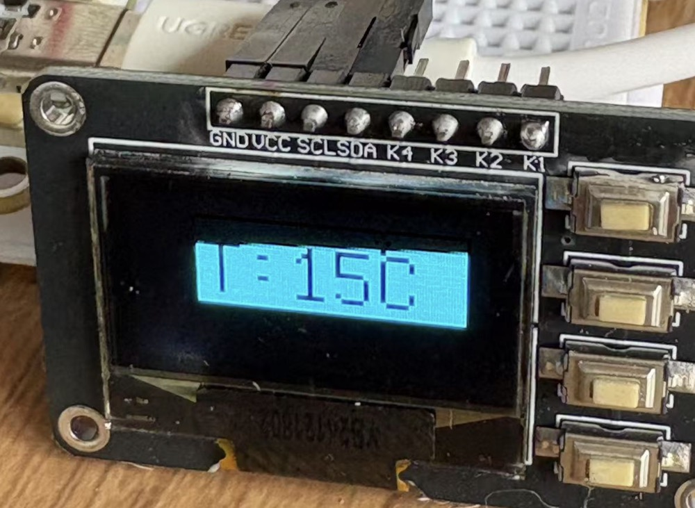

0.96寸OLED显示屏12864屏模块带矩阵4个按键接口 键盘IIC SSD1306。

<!--more-->

## 一、显示屏介绍


## 二、简单测试

### 电路连接
按照这个电路图来连接即可。

电源接 3.3v，分别接好 scl 和 sda 线，使用下面的程序即可运行。

### 程序编写
 1. 驱动文件：ssd1306.py，存放在 lib目录下。这个文件github 都有，搜索就可以拿到。
 2. 测试文件：main.py，文件内容如下：

``` python
import network
import time
import urequests
import json
from machine import SoftI2C, Pin
from lib import ssd1306

def oled_test():
    # Define pin assignments
    scl_pin = Pin(22)  # Clock
    sda_pin = Pin(21)  # Data
    # Initialize SoftI2C
    i2c = SoftI2C(scl=scl_pin, sda=sda_pin)

    # Set up SSD1306 OLED Display
    oled_width = 128
    oled_height = 64
    oled = ssd1306.SSD1306_I2C(oled_width, oled_height, i2c)
    
    # Clear the display before writing new text
    oled.fill(0)
    
    # Write text "Hello World" at coordinates (0, 0)
    # Write text "Hello World" at coordinates (0, 0)
    oled.text('Hello World Hello World', 0, 0)
    oled.text('Hello World Hello World', 0, 10)
    oled.text('Hello World Hello World', 0, 20)
    oled.text('Hello World Hello World', 0, 30)
    oled.text('Hello World Hello World', 0, 40)
    oled.text('Hello World Hello World', 0, 50)
    oled.text('Hello World Hello World', 0, 60)
    
    # Update OLED to show text
    oled.show()

if __name__ == "__main__":
    oled_test()
```
### 测试结果



## 中文字库加载测试
屏幕自己没有汉字字库，所以只能显示数字，英文字母和一些标点符号。我在网上找了一个字库文件和字库驱动，测试之后发现也是可以的。还是挺不错的。

### 需要的文件：
这些文件在 github 上都可以找到，可以直接按照文件名搜索就可以得到。
1. 字库驱动：ufont.py
2. 字库文件：unifont-14-12917-16.v3.bmf，这个文件有 400多 k 大。
3. 测试程序，这里只要再加如字库驱动的引入，并增加一个测试函数即可，代码如下：

``` python
from lib import ufont
def oled_font_test():
    # Define pin assignments
    scl_pin = Pin(22)  # Clock
    sda_pin = Pin(21)  # Data
    # Initialize SoftI2C
    i2c = SoftI2C(scl=scl_pin, sda=sda_pin)

    # Set up SSD1306 OLED Display
    oled_width = 128
    oled_height = 64
    display = ssd1306.SSD1306_I2C(oled_width, oled_height, i2c)
    font = ufont.BMFont("unifont-14-12917-16.v3.bmf")

    wait("""
    # 最简单的显示 "你好"
    #   其中指定 `show=True` 使得屏幕及时更新
    """, 6)
    font.text(display, "你好", 0, 0, show=True)
    
    wait("""
    # 如果想让文字显示在屏幕正中间，可以通过指定文本左上角位置来修改显示位置
    """, 5)
    font.text(display, "你好", 48, 16, show=True)

    wait("""
    # 此时你会发现：上一次显示显示的文字不会消失。因为你没有指定清屏参数：`clear=True`;让我们再试一次
    #   注意，请使用修改后的 `ssd1306.py` 驱动，否则请自行调用`display.fill(0)`
    """, 10)
    font.text(display, "你好", 48, 16, show=True, clear=True)

    wait("""
    # 显示英文呢？
    """, 3)
    font.text(display, "He110", 48, 8, show=True, clear=True)
    font.text(display, "你好", 48, 24, show=True)

    wait("""
    # 会发现一个汉字的宽度大概是字母的两倍，如果你需要等宽，可以指定参数 `half_char=False`
    """, 6)
    font.text(display, "HELLO", 32, 16, show=True, clear=True, half_char=False)

    wait("""
    # 显示的文字如果很长，会超出屏幕边界，例如：
    """, 3)
    poem = "他日若遂凌云志，敢笑黄巢不丈夫!"
    font.text(display, poem, 0, 8, show=True, clear=True)

    wait("""
    # 此时，需要指定参数 `auto_wrap=True` 来自动换行
    """, 5)
    font.text(display, poem, 0, 8, show=True, clear=True, auto_wrap=True)

    wait("""
    # 自动换行的行间距太小了？
    #   添加 `line_spacing: int` 参数来调整行间距, 此处指定 8 个像素
    """, 8)
    font.text(display, poem, 0, 8, show=True, clear=True, auto_wrap=True, line_spacing=8)

    wait("""
    # 调整字体大小，可以指定 `font_size: int` 参数
    #   注意：这会严重增加运行时间
    """, 8)
    font.text(display, "T:15℃", 24, 8, font_size=32, show=True, clear=True)

    wait("""
    # 当你使用墨水屏时，颜色可能会出现反转。或者你主动想要颜色反转
    #   可以指定参数 `reverse=Ture`
    """, 8)
    font.text(display, "T:15℃", 24, 8, font_size=32, show=True, clear=True, reverse=True)
```

### 测试结果展示

汉字展示：


温度符号，背景展示：
