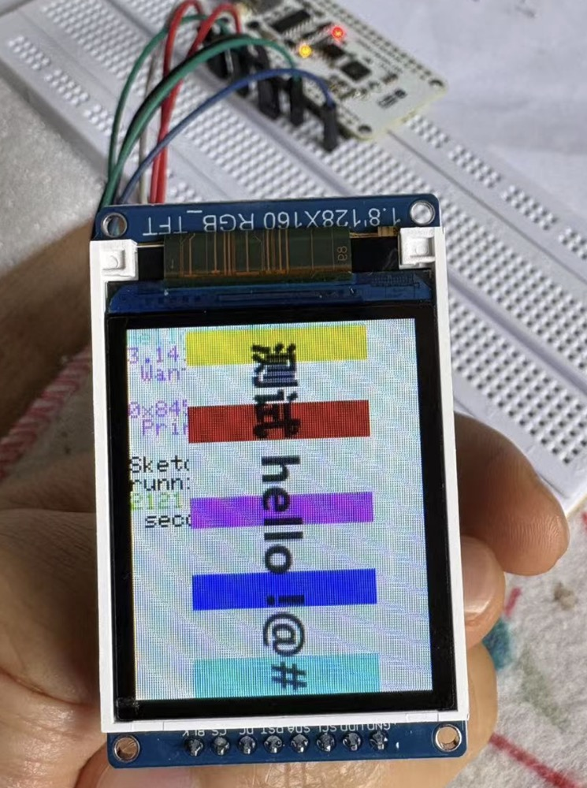

高清SPI 0.96寸1.3寸1.44寸1.8寸 TFT显示彩屏 OLED液晶屏 st7735。

<!--more-->

## 一、显示屏介绍


## 二、简单测试

### 电路连接
BLK可以不接线，GND直接连接开发板上标志GND的引脚，VCC连接开发板上标志3v3字样的引脚（3.3v输出口），剩下的接口对应esp32的引脚如下所示：

### 程序编写
 1. 驱动文件：st7735.py，存放在 lib目录下。这个文件github 都有，搜索就可以拿到。
 2. 字库文件：sysfont.py，存放在 lib目录下。这个文件github 都有，搜索就可以拿到。
 3. 测试文件：main.py，文件内容如下：

``` python
import network
import time
import urequests
import json
import utime
import math


from neopixel import NeoPixel
from machine import SoftI2C, Pin, SoftSPI
from lib.st7735 import TFT,TFTColor
from lib.sysfont import sysfont
from lib import ssd1306
from lib import ufont

def tft_7735_test(): 
    # 请修改为对应 FootPrint
    spi = SoftSPI(baudrate=600000000, polarity=0, phase=0, sck=Pin(18), mosi=Pin(23), miso=Pin(19))
    display = TFT(spi, 21, 2, 5)
    display.initg()#按RGB中的g重置屏幕
    display.rgb(True)
    display.fill(TFT.BLACK)
    display.invertcolor(True)#反转屏幕颜色，负片，反色

    display.fill(TFT.BLACK)
    v = 30
    display.text((0, v), "Hello World!", TFT.RED, sysfont, 1, nowrap=True)
    v += sysfont["Height"]
    display.text((0, v), "Hello World!", TFT.YELLOW, sysfont, 2, nowrap=True)
    v += sysfont["Height"] * 2
    display.text((0, v), "Hello World!", TFT.GREEN, sysfont, 3, nowrap=True)
    v += sysfont["Height"] * 3
    display.text((0, v), str(1234.567), TFT.BLUE, sysfont, 4, nowrap=True)
    time.sleep_ms(1500)
    display.fill(TFT.BLACK)
    v = 0
    display.text((0, v), "Hello World!", TFT.RED, sysfont)
    v += sysfont["Height"]
    display.text((0, v), str(math.pi), TFT.GREEN, sysfont)
    v += sysfont["Height"]
    display.text((0, v), " Want pi?", TFT.GREEN, sysfont)
    v += sysfont["Height"] * 2
    display.text((0, v), hex(8675309), TFT.GREEN, sysfont)
    v += sysfont["Height"]
    display.text((0, v), " Print HEX!", TFT.GREEN, sysfont)
    v += sysfont["Height"] * 2
    display.text((0, v), "Sketch has been", TFT.WHITE, sysfont)
    v += sysfont["Height"]
    display.text((0, v), "running for: ", TFT.WHITE, sysfont)
    v += sysfont["Height"]
    display.text((0, v), str(time.ticks_ms() / 1000), TFT.PURPLE, sysfont)
    v += sysfont["Height"]
    display.text((0, v), " seconds.", TFT.WHITE, sysfont)
    time.sleep_ms(5500)
        # 载入字体
    f=open('a4.bmp', 'rb')
    if f.read(2) == b'BM':  #header
        dummy = f.read(8) #file size(4), creator bytes(4)
        offset = int.from_bytes(f.read(4), 'little')
        hdrsize = int.from_bytes(f.read(4), 'little')
        width = int.from_bytes(f.read(4), 'little')
        height = int.from_bytes(f.read(4), 'little')
        if int.from_bytes(f.read(2), 'little') == 1: #planes must be 1
            depth = int.from_bytes(f.read(2), 'little')
            if depth == 24 and int.from_bytes(f.read(4), 'little') == 0:#compress method == uncompressed
                print("Image size:", width, "x", height)
                rowsize = (width * 3 + 3) & ~3
                if height < 0:
                    height = -height
                    flip = False
                else:
                    flip = True
                w, h = width, height
                if w > 80: w = 80
                if h > 160: h = 160
                display._setwindowloc((26,1),(w - 1 + 26,h - 1 + 1))#w方向移动26，h方向移动1
                for row in range(h):
                    if flip:
                        pos = offset + (height - 1 - row) * rowsize
                    else:
                        pos = offset + row * rowsize
                    if f.tell() != pos:
                        dummy = f.seek(pos)
                    for col in range(w):
                        bgr = f.read(3)
                        display._pushcolor(TFTColor(bgr[0],bgr[1],bgr[2]))#bgr颜色顺序，红蓝反转
    spi.deinit()
    
    pass

if __name__ == "__main__":
    tft_7735_test()
    pass
```
### 测试结果

