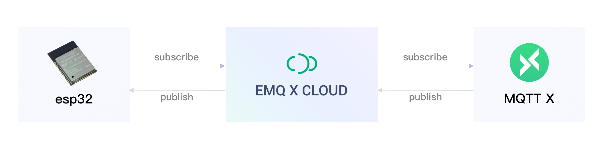
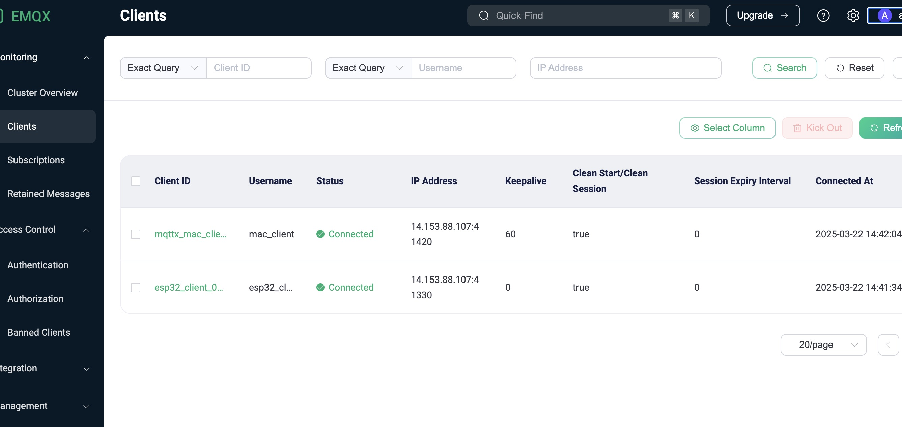
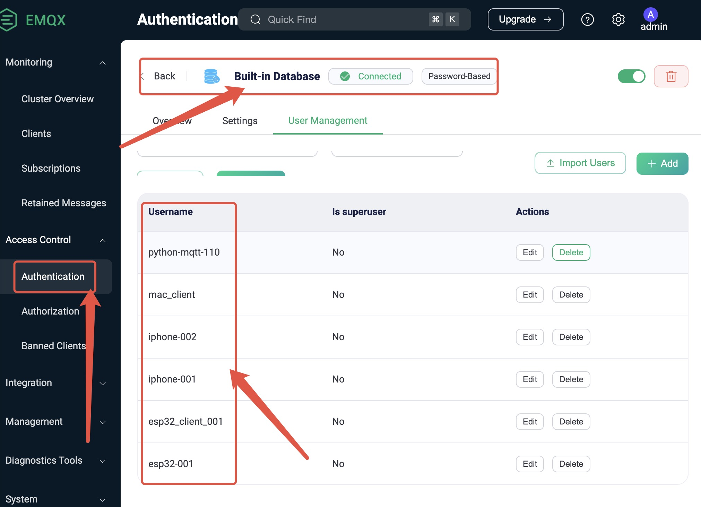
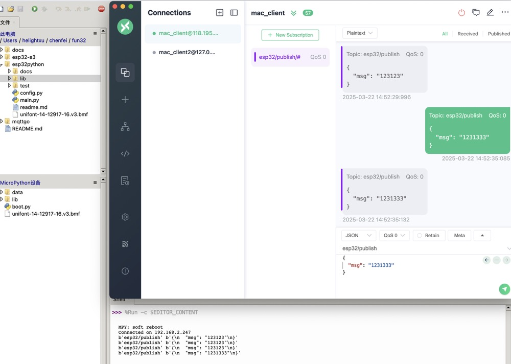
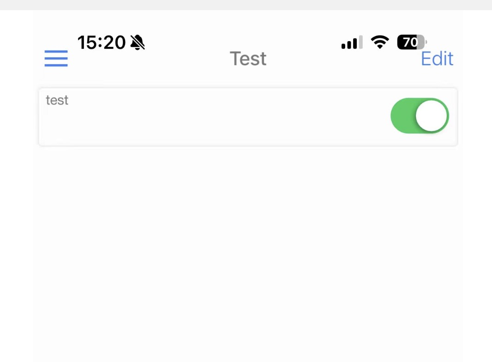
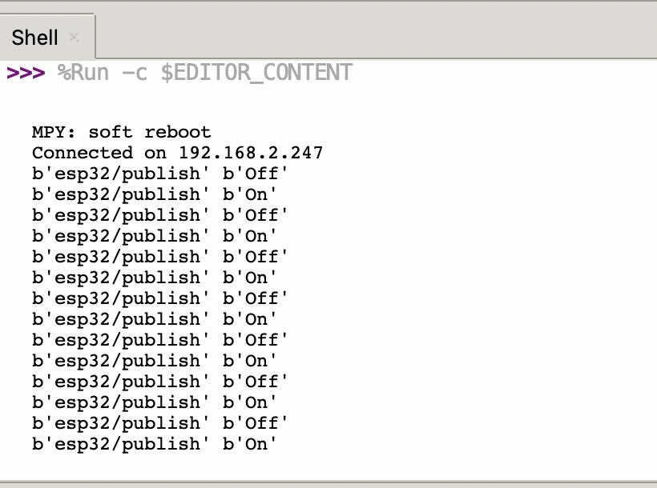

本文介绍如何把 esp32 通过 mqtt 连接到腾讯云的 mqtt 服务端，同时如何通过 pc 客户端和手机客户端对 esp32 进行指令下发，并且控制 esp32 上的设备进行操作。

<!--more-->

## 一、连接方式



## 二、服务部署
服务端是我在腾讯云的主机上部署的，使用的 mqtt 软件是 [emqx](https://www.emqx.com/) 的免费版本，还是比较好用的，在 ubuntu 上直接安装就可以了。安装过程非常简单，可以看官方的[安装指引](https://www.emqx.com/en/downloads-and-install/broker?os=Ubuntu)。

### 服务配置
配置文件/etc/emqx/emqx.conf
``` conf
node {
  name = "emqx@127.0.0.1"
  cookie = "emqxsecretcookie"
  data_dir = "/var/lib/emqx"
}

cluster {
  name = emqxcl
  discovery_strategy = manual
}

dashboard {
    listeners {
        http.bind = "127.0.0.1:18083"
        # http.bind = 18083
        # https.bind = 18084
        #https {
        #    ssl_options {
        #        certfile = "${EMQX_ETC_DIR}/certs/cert.pem"
        #        keyfile = "${EMQX_ETC_DIR}/certs/key.pem"
        #    }
        #}
    }
}
```
### web 服务配置
这里有个比较奇异的操作，就是如果要把管理端通过 nginx 代理出来，需要把 emqx 的前端代码独立拷贝出来，配置为一个独立站点。对它的 api 代理到本地的 18083 端口。

ubuntu 上安装之后默认的 dashboard 前端代码在这里：/usr/lib/emqx/lib/emqx_dashboard-5.2.1/priv/www/

我拷贝到了这里：/hdata/www/emqx_dashboard/，然后再配置一个 web 站点出来，nginx 的配置如下。这样就可以在外网用域名直接访问服务端了。

``` conf
server{
        listen 80 ;
        server_name mqtt.xxxx.cn;

    location / {
        root /hdata/www/emqx_dashboard/;
        index index.html;
    }
    location /api {
        proxy_pass                 http://127.0.0.1:18083;
        proxy_redirect             off;
        proxy_set_header           Host             $host;
        proxy_set_header           X-Real-IP        $remote_addr;
        proxy_set_header           X-Forwarded-For  $proxy_add_x_forwarded_for;

        }
}
```
访问效果如下：


### 访问连接控制
默认情况下，只要知道 mqtt 服务的 ip 地址和端口就可以直接连接上来。所以为了避免别人随意连接这里要启用连接鉴权。这里我配置了简单的用户名密码鉴权，给每个账户分配用户名和密码，客户端使用相应的用户名和密码就可以连接上来了。配置如下：



### pc端连接测试
我使用的 mac，emqx 也提供了 mac 上的客户端，可以在[这里下载mqttx](https://mqttx.app/)。
界面如下：


## 三、esp 端代码开发

### 程序编写
 1. 客户端库文件：umqtt.py，存放在 lib目录下。这个文件github 都有，搜索就可以拿到。
 2. 测试文件：main.py，文件内容如下：

``` python
import network
import time
import urequests
import json
import utime
import math

from lib.umqtt import MQTTClient


def sub_cb(topic, msg): # 回调函数，收到服务器消息后会调用这个函数
    print(topic, msg)

def mqttconnect():
    client_id = "esp32_client_001"
    topic = "esp32/publish"   
    username = client_id
    password = "xxxxxx"
    server = "111.111.111.111"

    # 2. 创建mqt
    c = MQTTClient(client_id, server, 0, username, password)  # 建立一个MQTT客户端
    c.set_callback(sub_cb)  # 设置回调函数
    c.connect()  # 建立连接
    c.subscribe(topic)  # 监控ledctl这个通道，接收控制命令
    while True:
        c.check_msg()
        time.sleep(1)
    pass

if __name__ == "__main__":
    # 1. 联网
    connect()
    mqttconnect()
    pass
        
```
### 测试结果


### 手机端连接测试
手机端也有一个 mqtt 的客户端 app，测试的话可以直接使用：IoT OnOff，我是 iphone，直接在服务市场就可以下载使用了。
我在这个 app 中配置了一个开关按钮，可以控制给topic: `"esp32/publish"` 发送一个 on和off 的指令。 如图：



发送后接受的数据如下图：



## 四、总结
mqtt 协议较为简单而且效率也非常高，目前生态也比较成熟，从客户端到服务端的相关软件服务体系都是比较完善的。对于嵌入式开发还是比较友好的。

MQTT协议设计极简，​头部仅2字节，传输开销远低于HTTP（HTTP头部约8000字节），在低带宽、高延迟的网络中表现优异。其二进制编码特性（如Protocol Buffer）进一步压缩数据体积，序列化效率比JSON高3-10倍。
协议支持TLS加密传输和用户名/密码认证，可通过ClientID、IP地址实现访问控制（ACL）。生态方面：

​客户端覆盖广：从嵌入式设备（ESP8266、STM32）到X86平台均有成熟SDK
​服务端多样化：Mosquitto、EMQX等开源Broker，以及阿里云、AWS等商业方案
​开发便捷：支持30+编程语言，提供Paho、MQTT.js等开源库

MQTT凭借轻量、可靠、灵活的特性，已成为物联网通信的事实标准。其成熟的生态和低开发门槛，尤其适合嵌入式设备在复杂网络环境中的高效通信需求。

所以玩起来还是挺好用的，可以做远程控制灯，控制电视，控制各种家电等等。你也可以来试试。