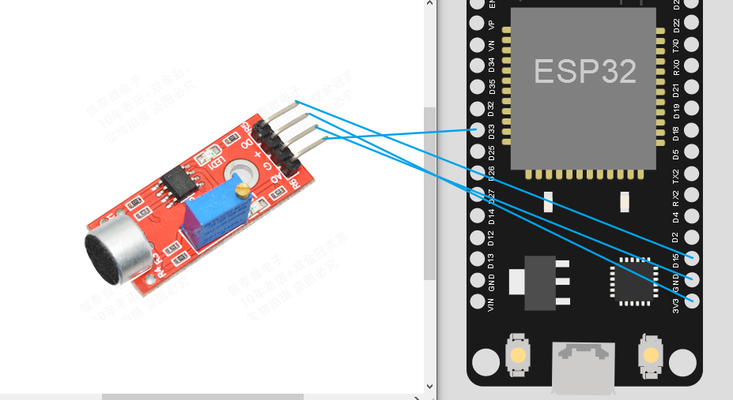
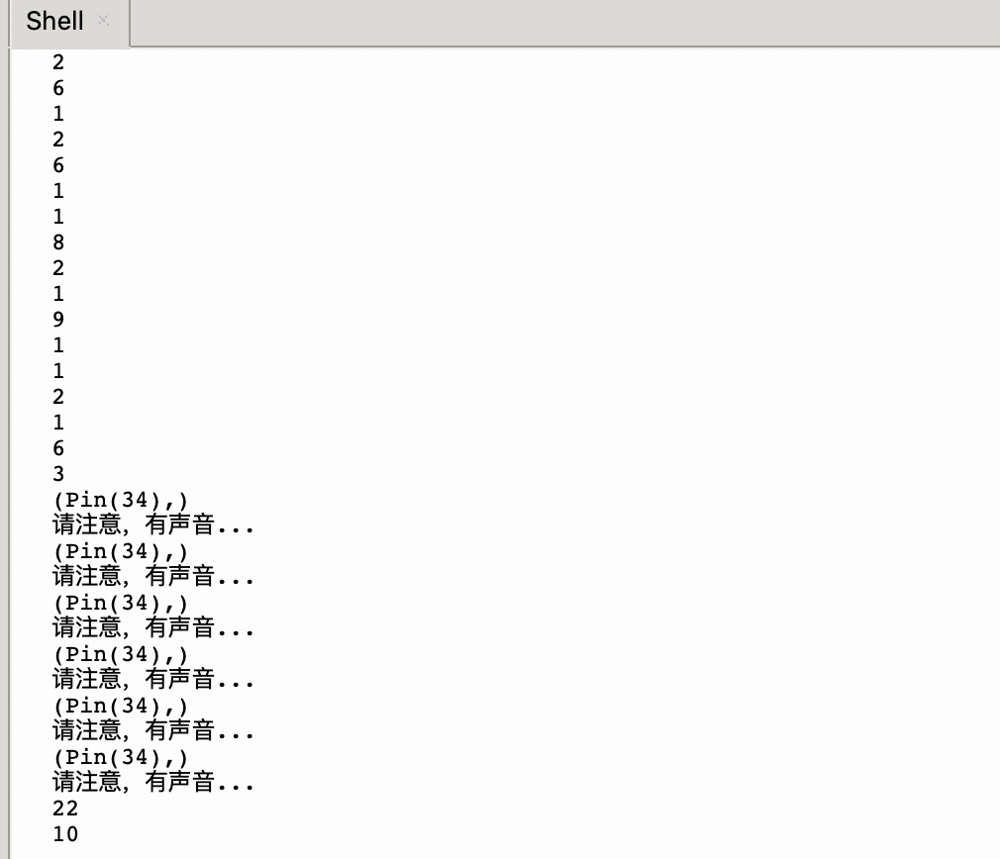

## 高感度麦克风传感器模块 模块特点：
1、有3mm的安装螺丝孔
2、使用5v直流电源供电
3、有模拟量输出
4、有阀值翻转电平输出
5、高感度麦克风，灵敏度高。
6、有电源指示灯
7、比较器输出有指示灯


<!--more-->

## 一、连接方式


## 二、实验设计
程序设计中我加入了声音大于一个值的时候就点亮一个 led 灯，做到了声控灯。led 灯的控制，这里使用了 14 端口。
模拟获取端口是 35，数字获取端口为 34。

## 三、程序编写
 1. 测试文件：soundled.py，文件内容如下：

``` python
from machine import I2C,Pin, ADC
import time
 
# 创建模拟量对象
sound_analog = ADC(Pin(35))
sound_analog.atten(ADC.ATTN_11DB)  # 配置测量量程为3.3V

# 创建数字量对象
p12 = Pin(34, Pin.IN)

# 创建LED对应Pin对象
led_pin = Pin(14, Pin.OUT)
 
# 定义一个函数，参数设置为可变
def sound_func(*argc):
    print(argc)
    print("请注意，有声音...")

def sound_check():
    p12.irq(sound_func, Pin.IRQ_RISING)  # 设置中断。当有声音时调用此中断
    
    itime = 0
    # 循环检测
    while True:
        sound_value = sound_analog.read()  # 模拟量输出范围0-4095
        if sound_value > 0:
            print(sound_value)
            if sound_value > 10:
                led_pin.value(1)
        itime+=1
        if itime > 10:
            itime = 0
            led_pin.value(0)
        time.sleep(0.3)
```
2. main.py 文件内容如下：
``` python
from funtools import soundled

if __name__ == "__main__":
    soundled.sound_check()
```
## 四、测试结果



## 五、总结

本文成功实现了基于 ESP32 的声控 LED 灯系统。通过高感度麦克风传感器模块采集声音信号，当声音强度超过设定阈值时，自动点亮 LED 灯。系统使用了模拟输入（Pin 35）检测声音强度，数字输入（Pin 34）检测声音触发，以及数字输出（Pin 14）控制 LED 灯。

代码设计采用了中断机制和定时检测相结合的方式，实现了对声音的实时响应。这种声控系统可应用于智能家居、安防监控等场景，是一个物联网应用的基础实践案例。
