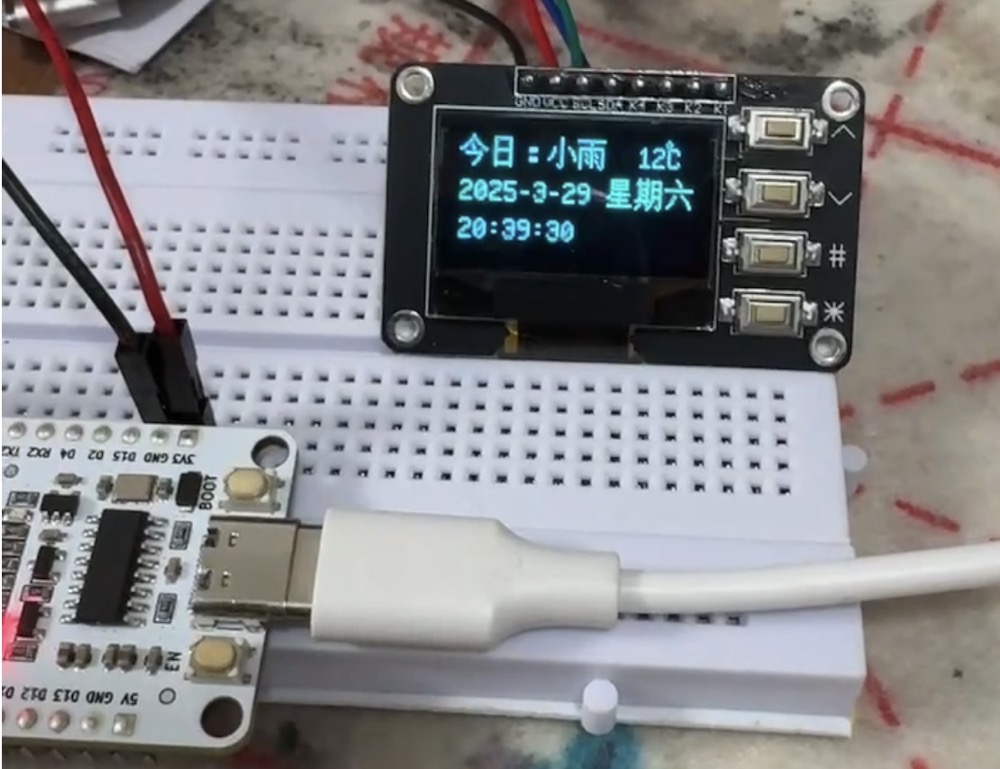

## 一、软/硬件条件：
1. thonny软件
2. ESP32开发板
3. 0.96寸OLED显示屏12864屏模块带矩阵4个按键接口 键盘IIC SSD1306。

## 二、实验接线：
硬件连接参考[OLED显示屏12864屏IIC SSD1306使用](../04oled1306)。

## 三、天气API接口
📍心知天气：https://www.seniverse.com/

API 地址：
http://api.seniverse.com/v3/weather/now.json?key=xxx&language=zh-Hans&unit=c&location=

## 四、主要代码：
### main.py
``` python
import _thread
import urequests
import json
import utime
import time

from lib import wifi
from lib import zhdate

from funtools import ssd1306fun
from funtools import datefun
from funtools import weatherfun


def RTCThread():
#    global oleddisp, datertc, gstrweather
    print("RTCThread start: ")
    while True:
        datelist = datertc.get_datetime()  # 获取当前时间
        show_text = gstrweather + "" + datelist[0] + "" + datelist[1]
        print(show_text)
        oleddisp.show_text(show_text, 0, 0, clear=True, auto_wrap=True)
        print(lunar_date)
        time.sleep(1)

def runWeatherThread(arg1):
    global gstrweather
    print(arg1)
    weatherinfo = weatherfun.WeatherInfo()
    while True:
        gstrweather = "今日：" + weatherinfo.get_weather(arg1)
        print(gstrweather)
        time.sleep(600)

if __name__ == "__main__":
    global oleddisp, datertc, gstrweather
    oleddisp = ssd1306fun.OLEDDisplay()
    # 1. 联网
    oleddisp.show_text("connection...", 0, 10, clear=True)
    wifi.wifi_connect('helightxx', 'xxxx')
    oleddisp.show_text("connection ok", 0, 10, clear=True)
    
    # 2. 时间初始化，需要网络，要在网络之后
    gstrweather = "今日：--, --"
    datertc = datefun.DateRTC()
    datertc.initntp()
    print(datertc.get_datetime())
    
    # 3. 创建线程
    _thread.start_new_thread(RTCThread, ())

    # 4. 定期获取天气信息
    runWeatherThread("shenzhen")
```

main文件里面执行步骤：
1. 连上 wifi。
2. 初始化时间获取，使用 ntp 更新时间。
3. 起一个线程 RTCThread 更新时间信息，并且做最终显示信息到 oled 显示屏。
4. 主循环 runWeatherThread 来定时获取天气信息。

这里为什么要起两个线程呢？当初设计的思路是想实时显示时间，如果把获取天气和显示时间这两件事情串行，会发现一个问题！那就是联网获取天气耗时太长了（超过1s），导致显示的时间秒数会跳秒，并不是+1s，而是+2s。所以把这两件事情并行执行，获取天气间隔600s更新，显示时间和天气间隔1s执行。

### weatherfun.py
这个是通过天气 api 获取指定地点的天气信息，就是一个 http 请求，相对比较简单，判断 http 的返回码。返回值是 json 格式的，使用 json 库进行解析，解析出想要的字段进行返回用于显示。
``` python
import urequests
import json

class WeatherInfo:
    def __init__(self):
        self.api = "http://api.seniverse.com/v3/weather/now.json?key=SjQE6qklMpxBpVO1C&language=zh-Hans&unit=c&location="

  
    def get_weather(self, citycode):
        """
        Get the weather information of the city.
        """
        url = self.api + citycode
        print(url)
        ret = urequests.get(url)
        print(ret.status_code)
        if ret.status_code != 200:
            print("ret error try again")
            return "获取天气信息失败"
        else:
            parsed = ret.json()
            print(parsed)
            print(type(parsed))
 
            # strweather = parsed["forecasts"][0]["casts"][0]["dayweather"]
            strweather = parsed["results"][0]["now"]["text"] + "  " + str(parsed["results"][0]["now"]["temperature"]) + "℃"
            print("ret ok: " + strweather)
            return strweather

```

## 四、测试结果




## 五、总结

本项目成功实现了一个基于 ESP32 和 OLED 显示屏的天气时钟，主要有以下几个技术要点：

1. **多线程设计**：通过 `_thread` 模块创建了两个并行执行的线程，一个用于实时更新和显示时间信息，另一个用于定期获取天气数据。这种设计解决了串行执行时天气API请求延迟导致的时间显示跳秒问题。

2. **网络通信**：利用 `urequests` 模块实现了与天气API的HTTP通信，获取实时天气数据并解析JSON格式的返回结果。

3. **模块化编程**：将功能分散到不同的模块中（如 `ssd1306fun`、`datefun`、`weatherfun`等），提高了代码的可维护性和可读性。

4. **硬件交互**：通过I2C协议与OLED显示屏进行通信，实现文本信息的显示。

5. **时间同步**：使用NTP协议从网络获取准确时间，确保时钟显示的准确性。

这个项目展示了在 ESP32 上实现多任务并行处理，以及如何将网络功能、时间同步和显示功能有机结合，作为一个入门玩法还是挺不错的，也欢迎大家提出问题。
