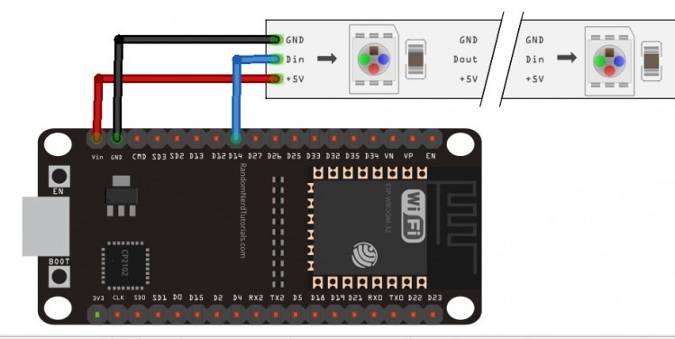
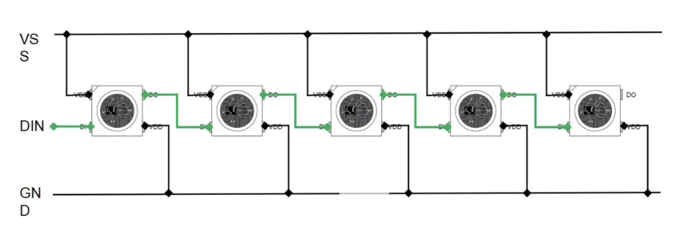
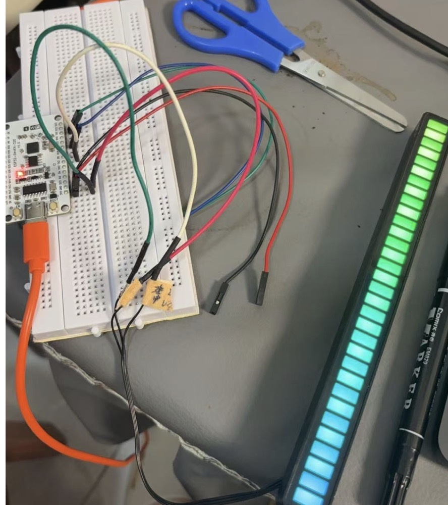
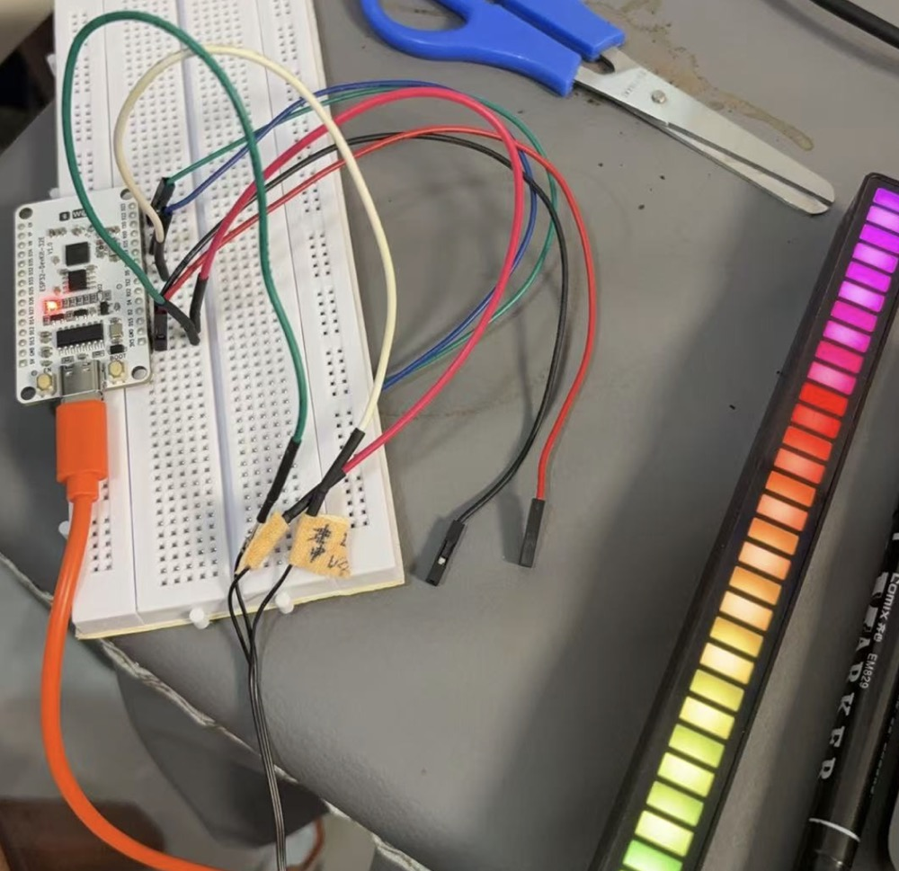

本文介绍如何使用 esp32 通过 

neopixel 库来操作 ws2812 选彩灯，这个灯是小朋友上一个硬件课发的，之后就没有啥用了，想再次使用起来，而且可以使用 esp32 玩出更多的花样。
<!--more-->
## 一、WS2812简介
### 1、基础特性​
1. WS2812 在 5050 封装内集成了控制电路和 RGB 发光单元，形成独立像素点。
2. 每个灯珠通过单线串行通信接收数据，支持无限级联（实际受刷新率限制）。​单线控制​：仅需一根数据线即可控制所有灯珠，简化布线。
3. ​自动信号整形​：每个灯珠对信号进行整形后转发，避免波形畸变累积。
4. 支持 24 位真彩色（RGB 各 8 位），可显示 1677 万种颜色。256 级亮度调节，刷新频率 ≥400Hz，动态效果流畅。
5. ​工作电压​：4.5–5.5V（典型 5V），部分型号支持 3.3V 控制电平。
6. ​电流消耗​：每颗灯珠全亮时约 60mA（红、绿、蓝各 20mA）。

### 2、应用场景​
1. ​智能家居：氛围灯带、电视背光，支持语音控制（如小智 AI）和动态光效（彩虹渐变、呼吸灯）。
2. ​艺术装置​：音乐频谱可视化、互动灯光雕塑，通过传感器（声音、运动）触发实时效果。
3. ​商业展示​：动态广告屏、零售灯箱，支持远程物联网控制。
4. ​穿戴设备​：LED 服饰、安全警示灯，轻量级且功耗低。

## 二、硬件连接
和 ESP32 连接图


基本电气图：

在使用的过程中，我们往往会使用不止一个 LED 灯，会将多个灯级联成灯带或者灯板，我们这个实验使用的就是灯板。具体级联方式如图：其中 DIN 作为数据的输入端，每个 LED 需要 24 位数据控制多出的数据会通过 DOUT 引脚传递给下一个 LED，以此类推当WS2812B接收到一定的电平时数据被写入LED，灯的颜色发生改变。


## 三、常用方法
1. 设置单个 LED 颜色
``` python
np[index] = (r, g, b)      # RGB 模式
np[index] = (r, g, b, w)   # RGBW 模式
```
2. 批量设置颜色
``` python
np.fill((r, g, b))         # 所有 LED 设为同一颜色
```
3. 写入数据到 LED
``` python
np.write()                 # 必须调用此方法，颜色才会生效
```
4. 清空颜色
``` python
np.fill((0, 0, 0))
np.write()
```
## 四、关键注意事项
1. 颜色范围
   RGB/W 值必须为 0-255 的整数，超出范围会导致异常：
``` python
np[0] = (255, 128, 0)    # 正确
np[0] = (300, -50, 0.5)  # 错误！
```

2. 颜色顺序问题 
   若颜色显示异常（如红色显示为绿色），需调整 `order` 参数：
   
``` python
# 常见 WS2812B 需要 GRB 顺序
np = NeoPixel(pin, 60, order="GRB")
```
   
3. 电源管理
   - 多颗 LED 全亮时电流极大（如 60 颗全白 ≈ 3.6A），需独立电源供电。
   - 数据线串联  220-470Ω 电阻，防止信号反射。

4. 时序兼容性
   若 LED 闪烁或不响应，尝试调整 timing参数：
``` python
np = NeoPixel(pin, 60, timing=0)  # 部分灯带需要 timing=0
```
## 五、高级技巧
1. Gamma 校正
   人眼对亮度感知非线性，通过 Gamma 表使渐变更平滑：
``` python
   gamma = [int(pow(i/255, 2.6)*255 for i in range(256)]
   np[i] = (gamma[r], gamma[g], gamma[b])
```
2. 减少刷新频率
   减少刷新频率提升性能

## 六、最终效果



## 七、总结
简单来说，WS2812 就是那种超级方便的彩色LED灯珠，只用一根线就能控制一大串，很魔幻吧？这篇文章主要讲了怎么用 ESP32 和 microPython 来玩转这种灯。

我认为 WS2812 是入门物联网和LED编程的绝佳选择，成本低、效果炫、代码简单。