开发环境配置，ESP32 DevKit 32E 使用。

<!--more-->

## 一、下载安装Thonny
Thonny是一个免费、开源的软件平台，体积小，界面简单，操作简单，功能丰富，是一个适合初学者的Python IDE。在本教程中，我们使用 Thonny 这个IDE在整个实验课程过程中开发ESP32。Thonny支持多种操作系统，包括Windows, Mac OS, Linux。

### 1.1 Mac系统
（1）软件下载和开源代码库分享

[Thonny的开源代码库](https://github.com/thonny/thonny)
[Thonny软件官网](https://thonny.org/)（请根据您的操作系统选择相应的选项下载安装）

鼠标触碰到下图箭头所示处，会出现MacOS的官方下载的版本选择。请根据您的操作系统选择相应的版本下载。最好下载最新版，否则可能不支持ESP32。

安装步骤请参考 章节 1.1 。

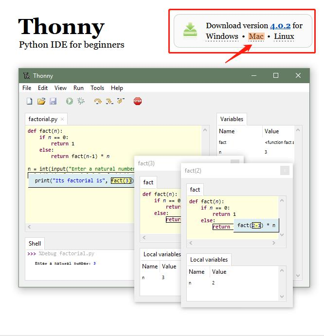

## 二、 Thonny软件基本配置与介绍
### 2.1 Thonny软件基本配置
（1）双击桌面的Thonny软件图标 ，出现语言选择和初始设置界面。

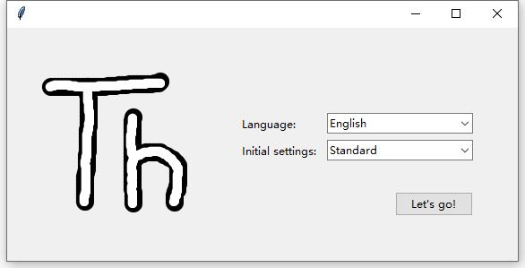

Language 选择“简体中文”。然后单击“Let's go!”结束设置。

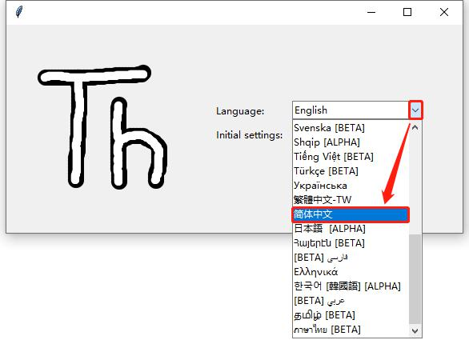

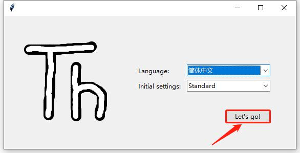

（2）单击“视图”，勾选“Shell”和“文件”

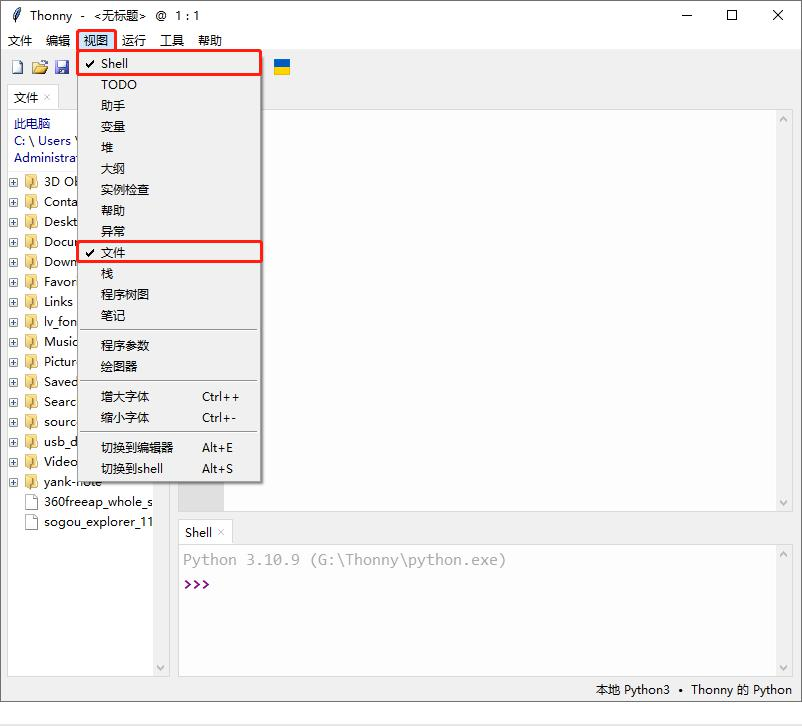

### 2.2 Thonny软件的介绍
（1）工具栏介绍
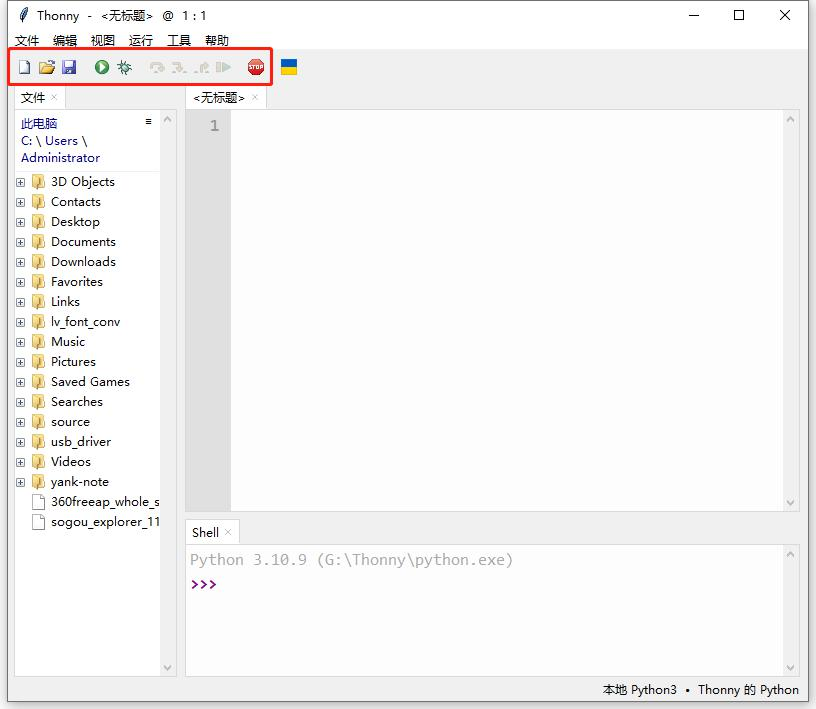

（2）界面介绍
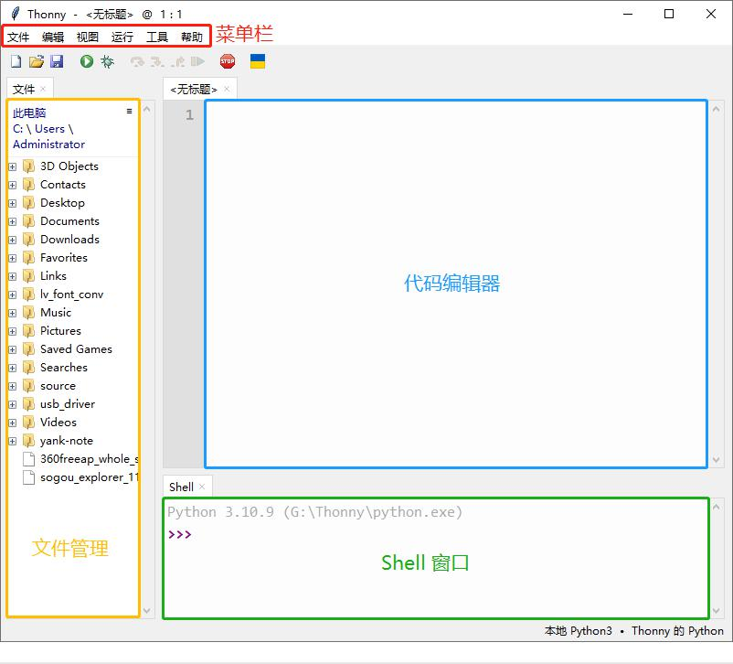

## 三、 烧录固件
要在ESP32主板上运行Python程序，我们需要先将固件烧入到ESP32主板。

### 3.1 下载Micropython固件

[microPython官方网站](http://micropython.org/)

[microPython的ESP32固件](https://micropython.org/download/esp32/) 打开microPython的ESP32固件网址，下载固件。

注意：本教程以官网V1.20.0固件为示例，现已更新到“ESP32_GENERIC-20231005-v1.21.0”版本，增加了蓝牙下载功能，后期更新的固件以同样的方法进行烧录！！！

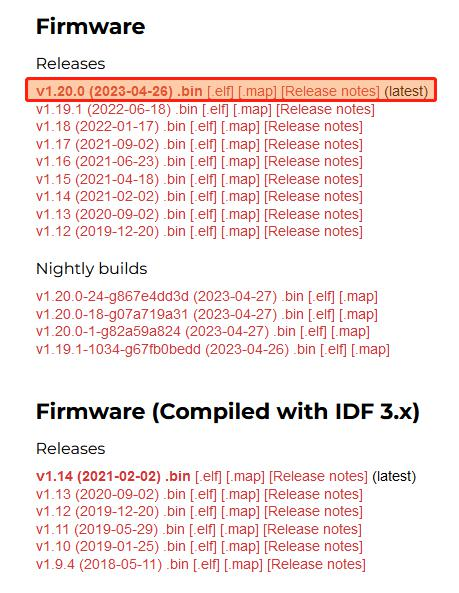

本教程中使用的固件是：esp32-20230426-v1.20.0.bin 。我们的资料中也提供了此版本的固件，路径如下图，另外建议使用 V1.21版本固件。

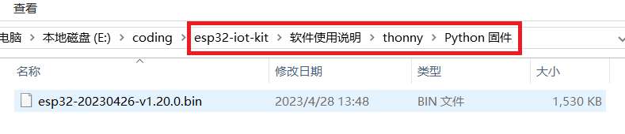

### 3.2 烧录Micropython固件
（1）将ESP32主板通过Type-C线连接到计算机。

（2）确保驱动程序已成功安装，并能正确识别COM端口。打开设备管理器并展开“端口”。（端口号不是固定的COM6，会有不同，是正常情况。）

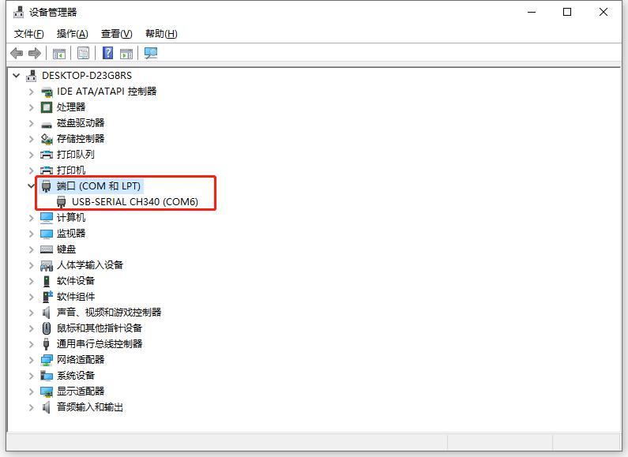

（3）打开Thonny，点击“运行” ，选择 “配置解释器”。

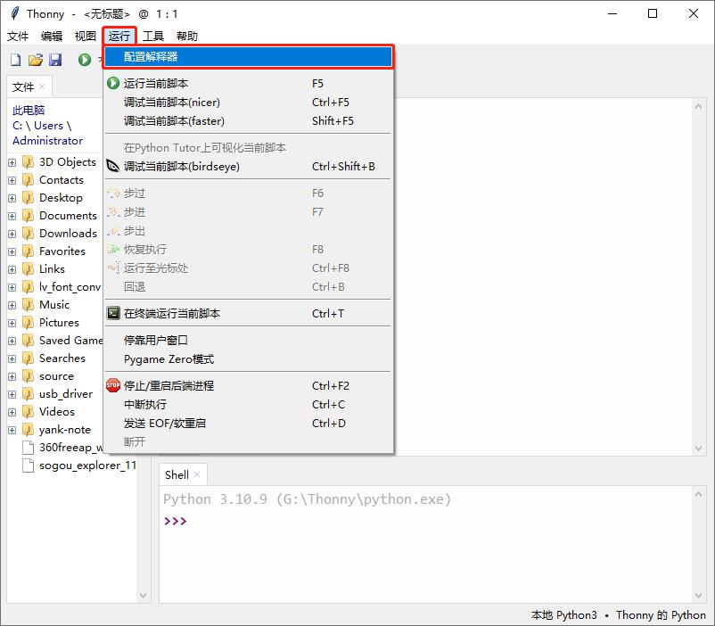

在解释器页面，解释器选择“Micropython (ESP32)”，端口或WebREPL选择“USB-SERIAL CH340 COM6）”（COM号以你电脑的端口为准）。然后单击“安装或更新MicroPython”。

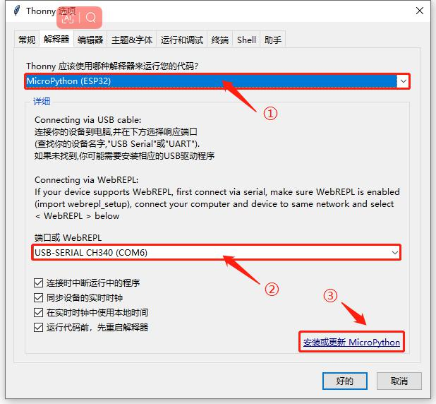

弹出“ESP32 firmware installer”页面，“Port”下拉选择“USB-SERIAL CH340（COM6）”。“Firmware”单击“Browse...”，选择下载好的microPython固件 “esp32-20230426-v1.20.0.bin”。检查“Flash mode”是否选择了“From image file(Keep)”，“Erase flash before installing”是否勾选。最后，单击“安装”，等待安装完成提示。

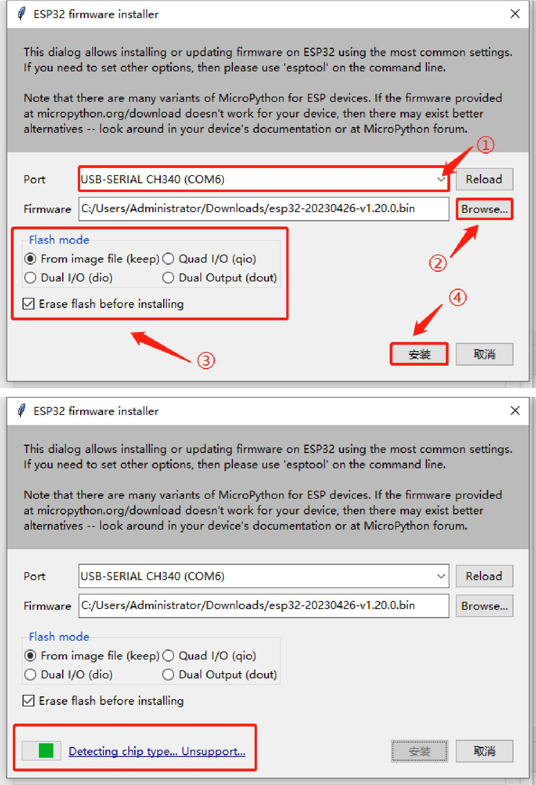

（4）安装完成，单击“关闭”。

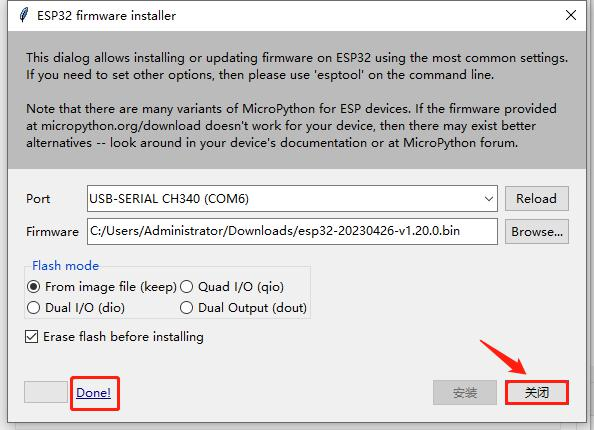

在“Thonny 选项”页面单击“好的”。

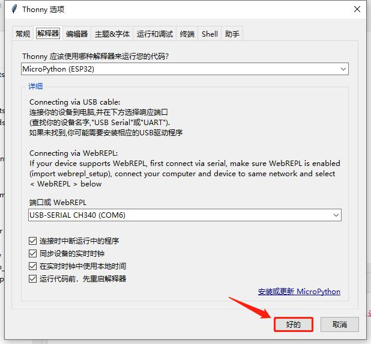

（5）点击 “停止/重启后端进程”按钮。

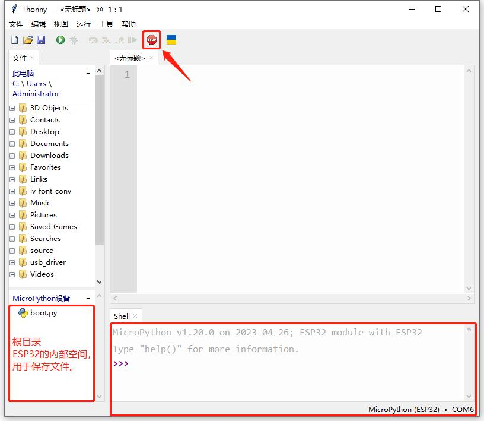

现在，一切准备工作都已就绪。

注意：由于Thonny版本不同，在烧录的第3步可能出现以下不能更新的情况。

## 四、Thonny常见的操作
### 4.1 上传代码到ESP32
为了方便起见，我们以boot.py为例。如果我们在每个代码目录中都添加了boot.py。ESP32每次重启时，它将首先执行根目录中的“boot.py”。

在00 Boot文件夹中选择“boot.py”，右键单击鼠标，选择“Upload to /”将代码上传到ESP32的根目录，然后选择“确定”。

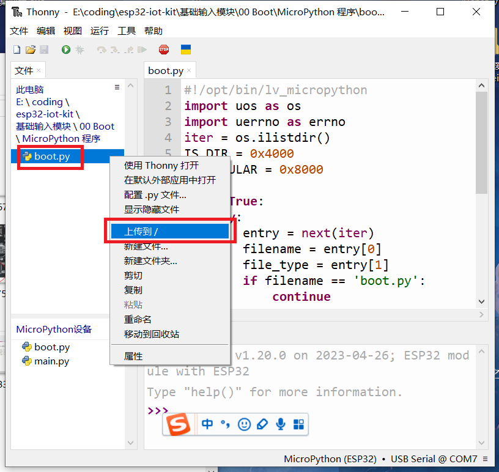

### 4.2 下载代码到电脑
在“MicroPython 设备”内选中“boot.py”，右键选择“下载到 D:\代码”把代码下载到你的电脑里。

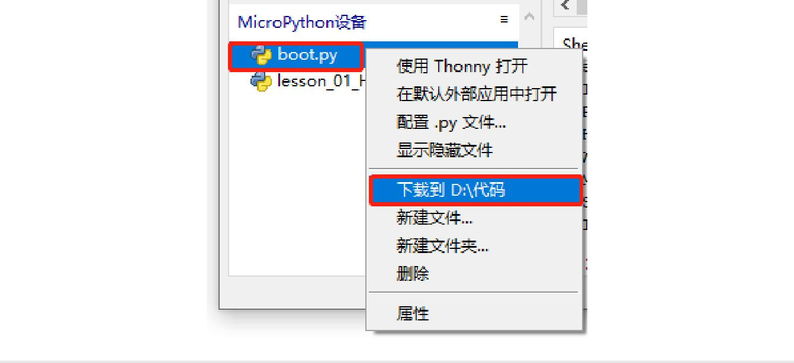

### 4.3 删除ESP32根目录下的文件
在“MicroPython 设备”内选中“boot.py”，右键单击它且选择“删除”，将“boot.py”从ESP32的根目录中删除。

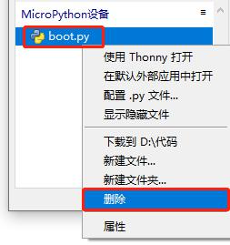

### 4.4 创建并保存代码
单击“文件”，然后选择“新建”。

在新打开的文件中输写代码。

单击菜单栏上的保存,可以将代码保存到你的电脑或ESP32上。这里选择保存到“MicroPython 设备”。

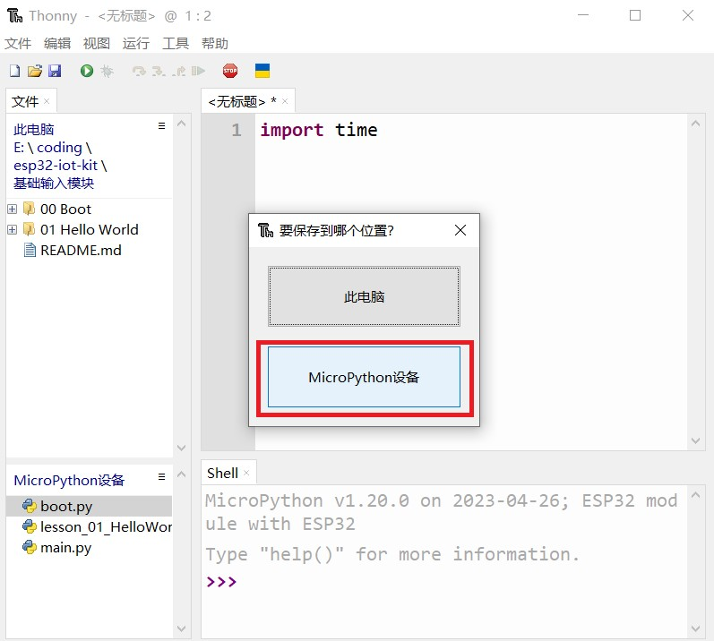

文件名命名为“main.py”，然后单击“好的”。

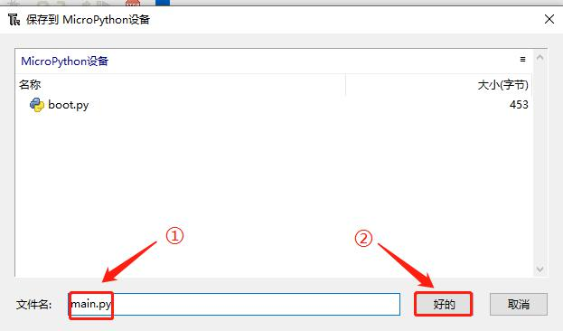

代码已经上传到ESP32。

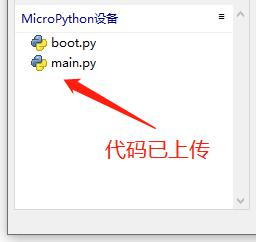